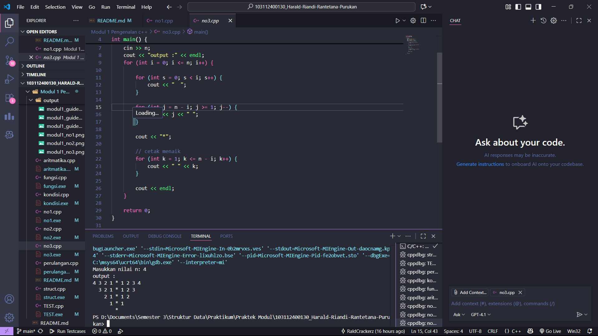

# <h1 align="center">Laporan Praktikum Modul 1<br>Pengenalan c++</h1>
<p align="center">Harald Riandi Rantetana Purukan - 103112400130</p>

## Dasar Teori

1. Struktur Data (Struct)
    Struct adalah kumpulan variabel dengan tipe data yang berbeda yang dikelompokkan dalam satu nama. Fungsinya untuk menyimpan data yang saling berhubungan, misalnya data mahasiswa yang terdiri dari NIM, nama, dan nilai.

2. Operator Aritmatika
    Operator aritmatika digunakan untuk melakukan operasi matematika dasar seperti penjumlahan (+), pengurangan (-), perkalian (*), pembagian (/), dan modulus (%).

3. Percabangan (Kondisi)
    Percabangan digunakan untuk membuat keputusan dalam program. C++ menyediakan if, if-else, dan switch-case untuk mengatur alur eksekusi berdasarkan kondisi tertentu.

4. Perulangan (Looping)
    Perulangan digunakan untuk mengeksekusi suatu perintah berulang kali. Dalam C++ terdapat for, while, dan do-while. Misalnya, mencetak angka berurutan atau membentuk pola.

5. Fungsi
    Fungsi adalah blok kode yang dapat dipanggil berulang kali. Tujuannya untuk memecah program menjadi bagian yang lebih kecil dan modular. Fungsi dapat menerima parameter dan mengembalikan nilai.

6. Konversi Angka ke Tulisan
    Konsep ini menggunakan array string untuk menyimpan representasi kata dari angka (misalnya “Satu”, “Dua”, dst.). Program memanfaatkan operasi pembagian dan modulus untuk memisahkan angka puluhan dan satuan, lalu menggabungkannya dalam bentuk tulisan.

7. Kondisi Khusus (Error Handling Sederhana)
    Misalnya pada pembagian: jika penyebut bernilai 0, maka program harus menolak pembagian untuk menghindari kesalahan runtime (division by zero).

## Guided

### soal 1

Struct


Penjelasan kode:


### soal 2

Aritmatika


### soal 3

Kondisi


### soal 4

Perulangan


### soal 5

Fungsi


### soal 6 

Test


## Unguided

### Soal 1

```c++
#include <iostream>
using namespace std;

int main() {
    float a, b;

    cout << "Masukkan bilangan pertama: ";
    cin >> a;
    cout << "Masukkan bilangan kedua: ";
    cin >> b;

    cout << "Hasil Penjumlahan: " << a + b << endl;
    cout << "Hasil Pengurangan: " << a - b << endl;
    cout << "Hasil Perkalian  : " << a * b << endl;

    if (b != 0) {
        cout << "Hasil Pembagian  : " << a / b << endl;
    } else {
        cout << "Pembagian tidak bisa dilakukan (pembagi = 0)" << endl;
    }

    return 0;
}

```

> Output
> 

Penjelasan kode :
1. Menggunakan float agar mendapatkan hasil akurat dalam pembagian
2. Input angka ke dalam variabel a dan b
3. Output berupa operasi sederhana, jika b sama dengan nol, maka output pembagian tidak bisa dilakukan karena hasilnya sama dengan tak hingga

### Soal 2

```c++
#include <iostream>
using namespace std;

// Array untuk menyimpan kata-kata angka
string satuan[] = {"", "Satu", "Dua", "Tiga", "Empat", "Lima", 
                   "Enam", "Tujuh", "Delapan", "Sembilan"};
string belasan[] = {"Sepuluh", "Sebelas", "Dua Belas", "Tiga Belas", "Empat Belas",
                    "Lima Belas", "Enam Belas", "Tujuh Belas", "Delapan Belas", "Sembilan Belas"};
string puluhan[] = {"", "", "Dua Puluh", "Tiga Puluh", "Empat Puluh", "Lima Puluh",
                    "Enam Puluh", "Tujuh Puluh", "Delapan Puluh", "Sembilan Puluh"};

// Fungsi untuk mengubah angka ke tulisan
string angkaToTulisan(int n) {
    if (n == 0) return "Nol";         // Kasus khusus
    if (n == 100) return "Seratus";   // Kasus khusus

    if (n < 10) {
        return satuan[n];             // 1–9
    } 
    else if (n < 20) {
        return belasan[n - 10];       // 10–19
    } 
    else {
        int p = n / 10;               // Ambil puluhan
        int s = n % 10;               // Ambil satuan
        if (s == 0) return puluhan[p]; 
        else return puluhan[p] + " " + satuan[s]; // Gabungan
    }
}

int main() {
    int angka;
    cout << "Masukkan angka (0 - 100): ";
    cin >> angka;

    if (angka < 0 || angka > 100) {
        cout << "Angka di luar jangkauan!" << endl;
    } else {
        cout << angka << " : " << angkaToTulisan(angka) << endl;
    }
    return 0;
}
```

> Output
> 

1. Menyimpan array dalam bentuk satuan, belasan, dan puluhan
2. String pada array satuan dikosongkan pada index nol, karena kita masukkan ke dalam kondisi khusus. Alasan nol tidak digabung kedalam array satuan, karena array satuan akan kita gunakan bersama dengan array puluhan, tidak mungkin ada puluhan seperti contoh 20 (dua puluh nol)
3. String pada array puluhan juga dikosongkan pada index nol dan satu, karena kita hanya akan menggunakan angka puluhan dari index 2, karena sepuluh sudah masuk ke index belasan
4. Input 1 hingga 9 akan mengambil memori dari array string satuan
5. Input 10 hingga 19 akan mengambil memori dari array string belasan. Kita gunakan mekanisme [n-10] pada array belasan, karena index 0 pada array belasan adalah 10, dengan range 10 - 19 
6. Input 20 hingga 99 akan mengambil memori dari array string puluhan, dengan mekanisme, input user akan dibagi dahulu dengan 10, untuk mengetahui angka puluhannya.
Kemudian akan dimodulus dengan 10, untuk mengetahui angka satuannya.
Kemudian angka puluhan akan mengambil memori dari array string puluhan dan angka satuan akan mengambil memori dari array string satuan
7. Output akan mengeluarkan tulisan "Angka diluar jangkauan" jika angka yang diinput user tidak memenuhi syarat (angka < 0 || angka > 100)
8. Output akan mengakses fungsi angkaToTulisan jika angka yang diinput memenuhi syarat

### Soal 3

```c++
#include <iostream>
using namespace std;

int main() {
    int n;
    cout << "Masukkan nilai n: ";
    cin >> n;
    cout << "output :" << endl;
    for (int i = 0; i <= n; i++) {
        
        for (int s = 0; s < i; s++) {
            cout << "  ";
        }

        for (int j = n - i; j >= 1; j--) {
            cout << j << " ";
        }

        cout << "*";

        for (int k = 1; k <= n - i; k++) {
            cout << " " << k;
        }

        cout << endl;
    }

    return 0;
}

```
> Output
> 

Penjelasan kode :
1. Variabel n sebagai input berapa angka terbesar yang akan dicetak
2. Iterasi i sebagai banyak baris yang akan di print (n+1). Contoh input 3, maka 4 baris di print dengan lambang bintang di baris terakhir
3. Iterasi j sebagai angka yang akan di print tiap baris, tiap baris akan selalu berkurang 1 angka (j = n-i). Contoh jika n = 3 dan i sekarang adalah 0 (baris pertama), maka j = 3 - 0, angka di print 3 2 1 sesuai iterasi
4. Print angka bintang setelah iterasi j
5. Iterasi k hampir sama seperti iterasi j, namun angka bertambah 1 angka, bukan berkurang.

## Referensi

1. https://www.geeksforgeeks.org/cpp-programming-basics/ (diakses 30 September)
2. https://eprints.uad.ac.id/32726/1/Dasar%20Pemrograman%20Bahasa%20C%2B%2B.pdf (diakses 30 september)
