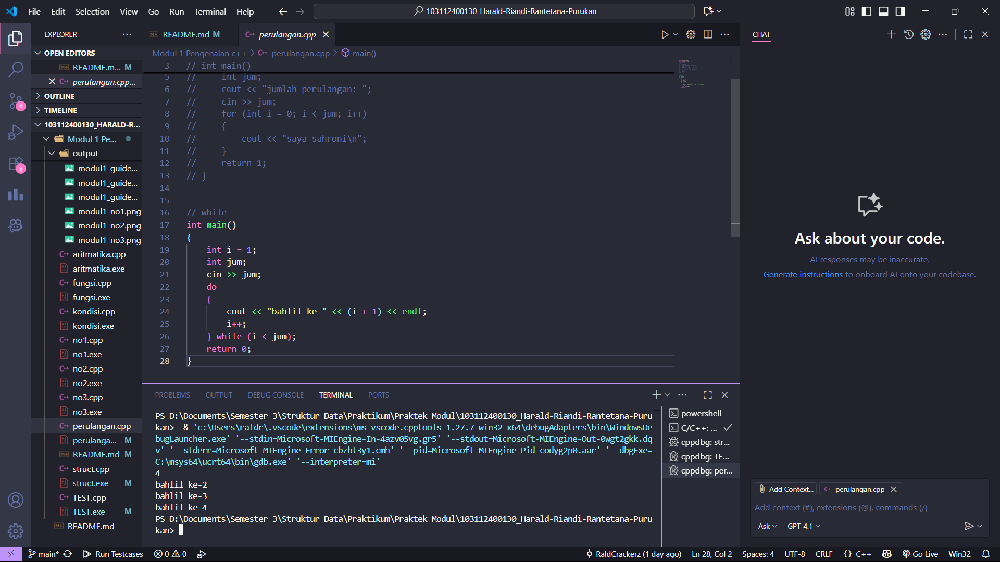

# <h1 align="center">Laporan Praktikum Modul 1<br>Pengenalan c++</h1>
<p align="center">Harald Riandi Rantetana Purukan - 103112400130</p>

## Dasar Teori

yang panjang dikit

## Guided

### soal 1

Struct


### soal 2

Aritmatika


### soal 3

Kondisi


### soal 4

Perulangan



### soal 5

Fungsi


### soal 6 

Test


## Unguided

### Soal 1

```c++
#include <iostream>
using namespace std;

int main() {
    float a, b;

    cout << "Masukkan bilangan pertama: ";
    cin >> a;
    cout << "Masukkan bilangan kedua: ";
    cin >> b;

    cout << "Hasil Penjumlahan: " << a + b << endl;
    cout << "Hasil Pengurangan: " << a - b << endl;
    cout << "Hasil Perkalian  : " << a * b << endl;

    if (b != 0) {
        cout << "Hasil Pembagian  : " << a / b << endl;
    } else {
        cout << "Pembagian tidak bisa dilakukan (pembagi = 0)" << endl;
    }

    return 0;
}

```

> Output
> 

Penjelasan kode :
1. Menggunakan float agar mendapatkan hasil akurat dalam pembagian
2. Input angka ke dalam variabel a dan b
3. Output berupa operasi sederhana, jika b sama dengan nol, maka output pembagian tidak bisa dilakukan karena hasilnya sama dengan tak hingga

### Soal 2

soal nomor 2A

```c++
#include <iostream>
using namespace std;

// Array untuk menyimpan kata-kata angka
string satuan[] = {"", "Satu", "Dua", "Tiga", "Empat", "Lima", 
                   "Enam", "Tujuh", "Delapan", "Sembilan"};
string belasan[] = {"Sepuluh", "Sebelas", "Dua Belas", "Tiga Belas", "Empat Belas",
                    "Lima Belas", "Enam Belas", "Tujuh Belas", "Delapan Belas", "Sembilan Belas"};
string puluhan[] = {"", "", "Dua Puluh", "Tiga Puluh", "Empat Puluh", "Lima Puluh",
                    "Enam Puluh", "Tujuh Puluh", "Delapan Puluh", "Sembilan Puluh"};

// Fungsi untuk mengubah angka ke tulisan
string angkaToTulisan(int n) {
    if (n == 0) return "Nol";         // Kasus khusus
    if (n == 100) return "Seratus";   // Kasus khusus

    if (n < 10) {
        return satuan[n];             // 1–9
    } 
    else if (n < 20) {
        return belasan[n - 10];       // 10–19
    } 
    else {
        int p = n / 10;               // Ambil puluhan
        int s = n % 10;               // Ambil satuan
        if (s == 0) return puluhan[p]; 
        else return puluhan[p] + " " + satuan[s]; // Gabungan
    }
}

int main() {
    int angka;
    cout << "Masukkan angka (0 - 100): ";
    cin >> angka;

    if (angka < 0 || angka > 100) {
        cout << "Angka di luar jangkauan!" << endl;
    } else {
        cout << angka << " : " << angkaToTulisan(angka) << endl;
    }
    return 0;
}
```

> Output
> 

1. Menyimpan array dalam bentuk satuan, belasan, dan puluhan 
2. String pada array satuan dikosongkan pada index nol, karena kita masukkan ke dalam kondisi khusus. Alasan nol tidak digabung kedalam array satuan, karena array satuan akan kita gunakan bersama dengan array puluhan, tidak mungkin ada puluhan seperti contoh 20 (dua puluh nol)
3. String pada array puluhan juga dikosongkan pada index nol dan satu, karena kita hanya akan menggunakan angka puluhan dari index 2, karena sepuluh sudah masuk ke index belasan
4. 
5. Kita gunakan mekanisme [n-10] pada array belasan, karena index 0 pada array belasan adalah 10, dengan range 10 - 19 

Kalau adalanjutan di lanjut disini aja

soal nomor 2B

```go
package main

func main() {
	fmt.Println("kode untuk soal nomor 2B")
}
```

> Output
> 

penjelasan bedanya sesuai soal

## Referensi

1. https://en.wikipedia.org/wiki/Data_structure (diakses blablabla)
