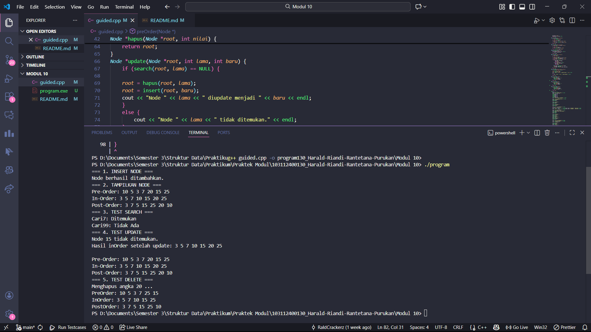
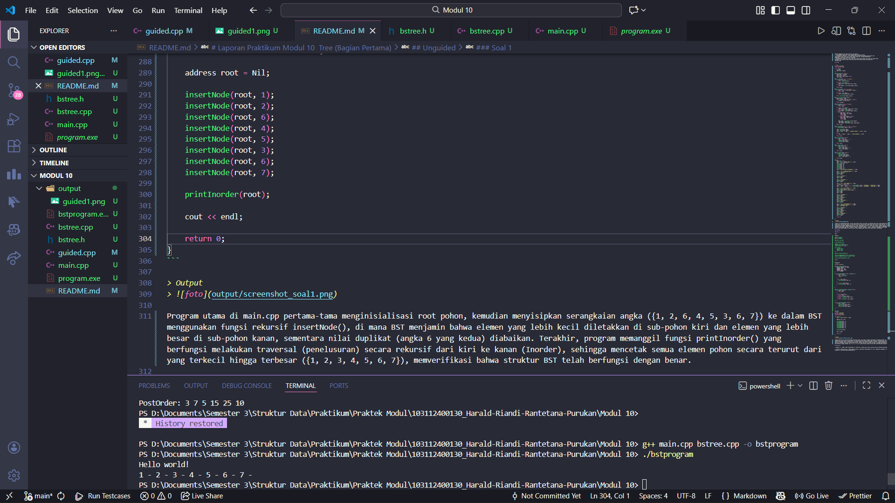

# <h1 align="center">Laporan Praktikum Modul 10 <br> Tree (Bagian Pertama) </h1>
<p align="center"> Harald Riandi Rantetana Purukan - 103112400130 </p>

## Dasar Teori

Secara harfiah, rekursif berarti suatu proses pengulangan sesuatu dengan cara kesamaan-diri atau 
suatu proses yang memanggil dirinya sendiri. Prosedur dan fungsi merupakan sub program yang 
sangat bermanfaat dalam pemrograman, terutama untuk program atau proyek yang besar.  
Manfaat penggunaan sub program antara lain adalah : 
1. meningkatkan readibility, yaitu mempermudah pembacaan program 
2. meningkatkan modularity, yaitu memecah sesuatu yang besar menjadi modul-modul atau 
bagian-bagian yang lebih kecil sesuai dengan fungsinya, sehingga mempermudah 
pengecekan, testing dan lokalisasi kesalahan. 
3. meningkatkan reusability, yaitu suatu sub program dapat dipakai berulang kali dengan hanya 
memanggil sub program tersebut tanpa menuliskan perintah-perintah yang semestinya 
diulang-ulang. 

## Guided

```cpp
#include <iostream>
using namespace std;

struct Node {
    int data;
    Node *kiri, *kanan;
}; 

Node *buatNode(int nilai) {
    Node *baru = new Node;
    baru->data = nilai;
    baru->kiri = baru->kanan = NULL;
    return baru;
}
Node *insert(Node *root, int nilai) {
    if (root == NULL) {
        return buatNode(nilai);
    }
    if (nilai < root->data) {
        root->kiri = insert(root->kiri, nilai);
    } else {
        root->kanan = insert(root->kanan, nilai);
    }
    return root;
}
Node *search(Node *root, int nilai) {
    if (root == NULL || root->data == nilai) {
        return root;
    }
    if (nilai < root->data) {
        return search(root->kiri, nilai);
    }
    return search(root->kanan, nilai);
}
Node *nilaiTerkecil(Node *node) {
    Node *current = node;
    while (current && current->kiri != NULL) {
        current = current->kiri;
    }
    return current;
}
Node *hapus(Node *root, int nilai) {
    if (root == NULL) {
        return root;
    }
    if (nilai < root->data) {
        root->kiri = hapus   (root->kiri, nilai);
    } else if (nilai > root->data) {
        root->kanan = hapus(root->kanan, nilai);
    } else {
        if (root->kiri == NULL) {
            Node *temp = root->kanan;
            delete root;
            return temp;
        } else if (root->kanan == NULL) {
            Node *temp = root->kiri;
            delete root;
            return temp;
        }
        Node *temp = nilaiTerkecil(root->kanan);
        root->data = temp->data;
        root->kanan = hapus(root->kanan, temp->data);
    }
    return root;
}
Node *update(Node *root, int lama, int baru) {
    if (search(root, lama) == NULL) {
    
    root = hapus(root, lama);
    root = insert(root, baru);
    cout << "Node " << lama << " diupdate menjadi " << baru << endl;
    }
    else {
        cout << "Node " << lama << " tidak ditemukan." << endl;
    }
    return root;
}
Node *preOrder(Node *root) {
    if (root != NULL) {
        cout << root->data << " ";
        preOrder(root->kiri);
        preOrder(root->kanan);
    }
    return root;
}
Node *inOrder(Node *root) {
    if (root != NULL) {
        inOrder(root->kiri);
        cout << root->data << " ";
        inOrder(root->kanan);
    }
    return root;
}
Node *postOrder(Node *root) {
    if (root != NULL) {
        postOrder(root->kiri);
        postOrder(root->kanan);
        cout << root->data << " ";
    }
    return root;
}
main() {
    Node *root = NULL;
    cout << "=== 1. INSERT NODE ===" << endl;
    root = insert(root, 10);
    insert(root, 5);
    insert(root, 20);
    insert(root, 3);
    insert(root, 7);
    insert(root, 15);
    insert(root, 25);
    cout << "Node berhasil ditambahkan." << endl;

    cout << "=== 2. TAMPILKAN NODE ===" << endl;
    cout << "Pre-Order: ";
    preOrder(root);
    cout << endl;

    cout << "In-Order: ";
    inOrder(root);
    cout << endl;

    cout << "Post-Order: ";
    postOrder(root);
    cout << endl;

    cout << "=== 3. TEST SEARCH ===" << endl;
    int cari1 = 7, cari2 = 99;
    cout << "Cari" << cari1 << ": " << (search(root, cari1) ? "Ditemukan" : "Tidak Ada") << endl;
    cout << "Cari" << cari2 << ": " << (search(root, cari2) ? "Ditemukan" : "Tidak Ada") << endl;
    
    cout << "=== 4. TEST UPDATE ===" << endl;
    root = update(root, 15, 17);
    cout << "Hasil inOrder setelah update: ";  
    inOrder(root);
    cout << endl;
    cout << endl;

    cout << "Pre-Order: ";
    preOrder(root);
    cout << endl;
    cout << "In-Order: ";
    inOrder(root);
    cout << endl;
    cout << "Post-Order: ";
    postOrder(root);
    cout << endl;
    
    cout << "=== 5. TEST DELETE ===" << endl;
    cout << "Menghapus angka 20 ..." << endl;
    root = hapus(root, 20); 

    cout << "PreOrder: ";
    preOrder(root);
    cout << endl;
    cout << "InOrder: ";
    inOrder(root);
    cout << endl;   
    cout << "PostOrder: ";
    postOrder(root);
    cout << endl;
    
    return 0;

}
```
> Output
> 

Program ini mengimplementasikan struktur data Binary Search Tree (BST). BST adalah pohon biner yang menjaga agar semua nilai di subtree kiri kurang dari nilai di node saat ini, dan semua nilai di subtree kanan lebih besar dari nilai di node saat ini. Program ini mengelola pohon dengan fungsi utama: buatNode (membuat node baru), insert (menyisipkan nilai baru sesuai aturan BST), search (mencari keberadaan nilai), dan hapus (menghapus node sambil mempertahankan properti BST, menangani kasus 0, 1, dan 2 anak). Fungsi update diimplementasikan dengan cara menghapus node lama dan menyisipkan node baru. Terakhir, fungsi traversal (preOrder, inOrder, postOrder) digunakan untuk mengunjungi dan mencetak semua node dalam urutan yang berbeda, di mana In-Order selalu menghasilkan urutan nilai yang terurut (ascending).

## Unguided

### Soal 1

Buatlah ADT Binary Search Tree menggunakan Linked list sebagai berikut di dalam file 
“bstree.h”.
Buatlah implementasi ADT Binary Search Tree pada file “bstree.cpp” dan cobalah hasil 
implementasi ADT pada file “main.cpp”.

bstree.h
```h
#ifndef BSTREE_H
#define BSTREE_H

#include <iostream>

using namespace std;

typedef int infotype;
typedef struct Node* address;
const address Nil = NULL;

struct Node {
    infotype info;
    address left;
    address right;
};

address alokasi(infotype x);

void insertNode(address &root, infotype x);
address findNode(infotype x, address root);

void printInorder(address root);

#endif
```

bstree.cpp
```cpp
#include "bstree.h"

address alokasi(infotype x) {
    address newNode = new Node;
    newNode->info = x;
    newNode->left = Nil;
    newNode->right = Nil;
    return newNode;
}

void insertNode(address &root, infotype x) {
    if (root == Nil) {
        root = alokasi(x);
        return;
    }
    
    if (x < root->info) {
        insertNode(root->left, x);
    } 
    
    else if (x > root->info) {
        insertNode(root->right, x);
    }  
}

address findNode(infotype x, address root) {
    if (root == Nil) {
        return Nil; 
    }

    if (x == root->info) {
        return root;
    } else if (x < root->info) {
        return findNode(x, root->left); 
    } else {
        return findNode(x, root->right); 
    }
}

void printInorder(address root) {
    if (root != Nil) {
        printInorder(root->left); 
        cout << root->info << " - "; 
        printInorder(root->right); 
    }
}
```

main.cpp
```cpp
#include <iostream>
#include "bstree.h"
using namespace std;

int main() {
    cout << "Hello world!" << endl;

    address root = Nil;

    insertNode(root, 1);
    insertNode(root, 2);
    insertNode(root, 6);
    insertNode(root, 4);
    insertNode(root, 5);
    insertNode(root, 3);
    insertNode(root, 6);
    insertNode(root, 7);
    
    printInorder(root);
    
    cout << endl; 

    return 0;
}
```

> Output
> 

Program utama di main.cpp pertama-tama menginisialisasi root pohon, kemudian menyisipkan serangkaian angka ({1, 2, 6, 4, 5, 3, 6, 7}) ke dalam BST menggunakan fungsi rekursif insertNode(), di mana BST menjamin bahwa elemen yang lebih kecil diletakkan di sub-pohon kiri dan elemen yang lebih besar di sub-pohon kanan, sementara nilai duplikat (angka 6 yang kedua) diabaikan. Terakhir, program memanggil fungsi printInorder() yang berfungsi melakukan traversal (penelusuran) secara rekursif dari kiri ke kanan (Inorder), sehingga mencetak semua elemen pohon secara terurut dari yang terkecil hingga terbesar ({1, 2, 3, 4, 5, 6, 7}), memverifikasi bahwa struktur BST telah berfungsi dengan benar.

### Soal 2

Buatlah fungsi untuk menghitung jumlah node dengan fungsi berikut. 
➢ fungsi hitungJumlahNode( root:address ) : integer 
➢ fungsi hitungTotalInfo( root:address, start:integer ) : integer  
➢ fungsi hitungKedalaman( root:address, start:integer ) : integer

```cpp
kode
```

> Output
> 

Penjelasan kode

### Soal 1

soal

```cpp
kode
```

> Output
> 

Penjelasan kode

## Referensi

1. Ma’arif, A. (2020). Dasar Pemrograman C++. UAD Press. Diakses dari https://eprints.uad.ac.id/32726/1/Dasar%20Pemrograman%20Bahasa%20C%2B%2B.pdf

2. (Penulis tidak tertulis). (tahun tidak tertulis). Algoritma & Pemrograman C++ [PDF]. Repository Unpkediri. Diakses dari https://repository.unpkediri.ac.id/2468/1/55201_0701107802.pdf
