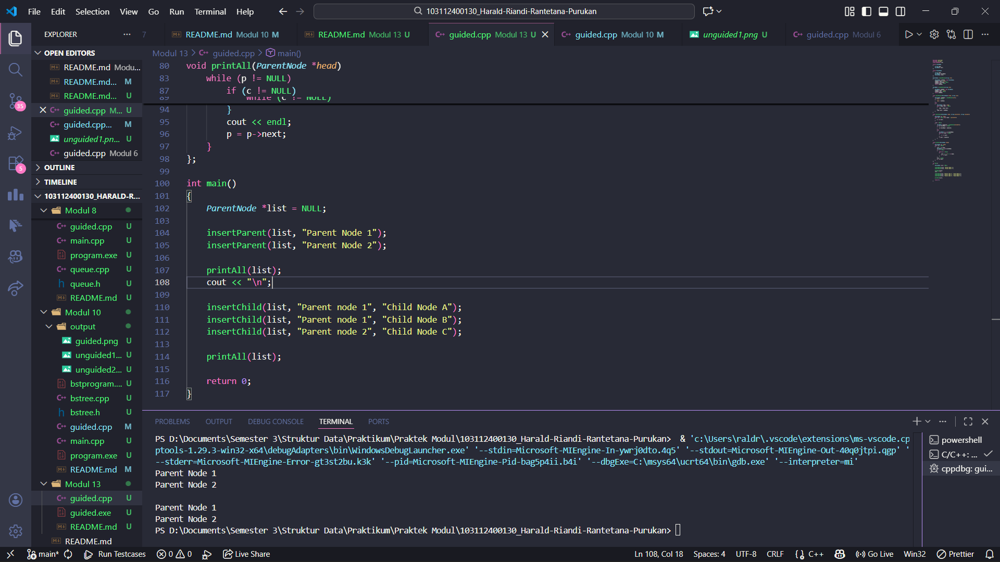
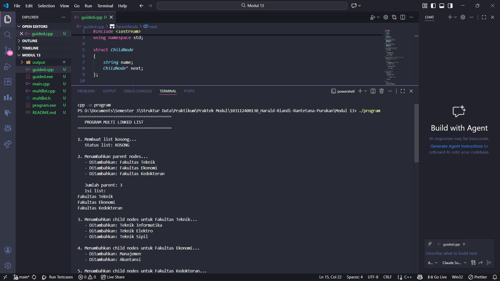

# <h1 align="center">Laporan Praktikum Modul X <br> Nama Modul</h1>
<p align="center"> Harald Riandi Rantetana Purukan - 103112400130 </p>

## Dasar Teori

Multi Linked List adalah struktur data lanjutan yang merupakan pengembangan dari linked list sederhana, di mana setiap node dapat memiliki lebih dari satu pointer yang menghubungkan ke node lain, membentuk struktur hierarkis atau multi-dimensional. Dalam implementasi multi linked list dua tingkat (two-level linked list), terdapat dua jenis node yaitu parent node dan child node, di mana parent node membentuk linked list utama yang setiap elemennya memiliki pointer tambahan (childHead) yang menunjuk ke linked list child tersendiri, sehingga menciptakan struktur parent-child yang kompleks. Struktur ini sangat efektif untuk merepresentasikan data hierarkis seperti organisasi perusahaan (departemen dan karyawan), sistem file (folder dan file), atau kategori produk (kategori utama dan subkategori), dengan kelebihan berupa fleksibilitas tinggi dalam penambahan dan penghapusan data, kemampuan merepresentasikan relasi one-to-many secara natural, serta alokasi memori yang dinamis, meskipun memiliki kompleksitas implementasi yang lebih tinggi dibanding linked list sederhana dan memerlukan traversal nested untuk mengakses child nodes yang menghasilkan kompleksitas waktu O(n × m) dalam worst case.

## Guided

### soal 1

```cpp
#include <iostream>
#include <string>
using namespace std;

struct ChildNode
{
    string name;
    ChildNode* next;
};

struct ParentNode
{
    string name;
    ChildNode* childHead;
    ParentNode* next;
};

ParentNode *createParent(string info)
{
    ParentNode* newNode = new ParentNode;
    newNode->name = info;
    newNode->childHead = NULL;
    newNode->next = NULL;
    return newNode;
}

ChildNode *createChild(string info)
{
    ChildNode* newNode = new ChildNode;
    newNode->name = info;
    newNode->next = NULL;
    return newNode;
}

void insertParent(ParentNode*& head, string info)
{
    ParentNode *newNode = createParent(info);
    if (head == NULL)
    {
        head = newNode;
    }
    else
    {
        ParentNode* temp = head;
        while (temp->next != NULL)
        {
            temp = temp->next;
        }
        temp->next = newNode;
    }
}

void insertChild(ParentNode *head, string parentInfo, string childInfo)
{
    ParentNode *p = head;
    while (p != NULL && p->name != parentInfo)
    {
        p = p->next;
    }

    if(p != NULL)
    {
        ChildNode *newChild = createChild(childInfo);
        if (p->childHead == NULL)
        {
            p->childHead = newChild;
        }
        else
        {
            ChildNode *c = p->childHead;
            while (c->next != NULL)
            {
                c = c->next;
            }
            c->next = newChild;
        }
    }
}

void printAll(ParentNode *head)
{
    ParentNode *p = head;
    while (p != NULL)
    {
        cout << p->name;
        ChildNode *c = p->childHead;
        if (c != NULL)
        {
            while (c != NULL)
            {
                cout << " ->" << c->name;
                c = c->next;
            }
        }
        cout << endl;
        p = p->next;
    }
};

int main()
{
    ParentNode *list = NULL;

    insertParent(list, "Parent Node 1");
    insertParent(list, "Parent Node 2");

    printAll(list);
    cout << "\n";

    insertChild(list, "Parent Node 1", "Child Node A");
    insertChild(list, "Parent Node 1", "Child Node B");
    insertChild(list, "Parent Node 2", "Child Node C");

    printAll(list);

    return 0;
}
```
> Output
> 

Kode ini mengimplementasikan struktur data linked list hierarkis dua tingkat yang terdiri dari ParentNode (node induk) dan ChildNode (node anak), di mana setiap parent dapat memiliki beberapa child yang tersimpan dalam linked list terpisah. Program menyediakan fungsi untuk membuat node baru (createParent dan createChild), menambahkan parent ke dalam list utama (insertParent), menambahkan child ke parent tertentu dengan mencari parent berdasarkan nama (insertChild), dan menampilkan seluruh struktur dengan format "Parent -> Child1 -> Child2" (printAll). 

## Unguided

### Soal 1

soal

multilist.h
```h
#ifndef MULTILIST_H
#define MULTILIST_H

#include <iostream>
#include <string>
using namespace std;

#define Nil NULL
#define info(P) (P)->info
#define next(P) (P)->next
#define first(L) ((L).first)
#define child(P) (P)->child

typedef bool boolean;
typedef string infotypeinduk;
typedef string infotypeanak;

// Struktur untuk list anak
struct elemenanak {
    infotypeanak info;
    elemenanak* next;
};
typedef elemenanak* address_anak;

struct listanak {
    address_anak first;
};

// Struktur untuk list induk
struct elemeninduk {
    infotypeinduk info;
    listanak child;
    elemeninduk* next;
};
typedef elemeninduk* address;

struct listinduk {
    address first;
};

typedef listinduk list;

/********* pengecekan apakah list kosong ***********/
boolean ListEmpty(listinduk L);
boolean ListEmptyAnak(listanak L);

/********* pembuatan list kosong *********/
void CreateList(listinduk &L);
void CreateListAnak(listanak &L);

/********* manajemen memori *********/
address alokasi(infotypeinduk P);
address_anak alokasiAnak(infotypeanak P);
void dealokasi(address P);
void dealokasiAnak(address_anak P);

/********* pencarian sebuah elemen list *********/
address findElm(listinduk L, infotypeinduk X);
address_anak findElmAnak(listanak Lanak, infotypeanak X);
boolean fFindElm(listinduk L, address P);
boolean fFindElmanak(listanak Lanak, address_anak P);
address findBefore(listinduk L, address P);
address_anak findBeforeAnak(listanak Lanak, infotypeanak X, address_anak P);

/********* penambahan elemen **********/
void insertFirst(listinduk &L, address P);
void insertAfter(listinduk &L, address P, address Prec);
void insertLast(listinduk &L, address P);
void insertFirstAnak(listanak &L, address_anak P);
void insertAfterAnak(listanak &L, address_anak P, address_anak Prec);
void insertLastAnak(listanak &L, address_anak P);

/********* penghapusan sebuah elemen *********/
void delFirst(listinduk &L, address &P);
void delLast(listinduk &L, address &P);
void delAfter(listinduk &L, address &P, address Prec);
void delP(listinduk &L, infotypeinduk X);
void delFirstAnak(listanak &L, address_anak &P);
void delLastAnak(listanak &L, address_anak &P);
void delAfterAnak(listanak &L, address_anak &P, address_anak Prec);
void delPAnak(listanak &L, infotypeanak X);

/********** proses semua elemen list *********/
void printInfo(listinduk L);
int nbList(listinduk L);
void printInfoAnak(listanak Lanak);
int nbListAnak(listanak Lanak);

/********** proses terhadap list **********/
void delAll(listinduk &L);

#endif
```

multilist.cpp
```cpp
#include "multilist.h"

/********* pengecekan apakah list kosong ***********/
boolean ListEmpty(listinduk L) {
    return first(L) == Nil;
}

boolean ListEmptyAnak(listanak L) {
    return first(L) == Nil;
}

/********* pembuatan list kosong *********/
void CreateList(listinduk &L) {
    first(L) = Nil;
}

void CreateListAnak(listanak &L) {
    first(L) = Nil;
}

/********* manajemen memori *********/
address alokasi(infotypeinduk P) {
    address newNode = new elemeninduk;
    if (newNode != Nil) {
        info(newNode) = P;
        next(newNode) = Nil;
        CreateListAnak(child(newNode));
    }
    return newNode;
}

address_anak alokasiAnak(infotypeanak P) {
    address_anak newNode = new elemenanak;
    if (newNode != Nil) {
        info(newNode) = P;
        next(newNode) = Nil;
    }
    return newNode;
}

void dealokasi(address P) {
    delete P;
}

void dealokasiAnak(address_anak P) {
    delete P;
}

/********* pencarian sebuah elemen list *********/
address findElm(listinduk L, infotypeinduk X) {
    address P = first(L);
    while (P != Nil && info(P) != X) {
        P = next(P);
    }
    return P;
}

address_anak findElmAnak(listanak Lanak, infotypeanak X) {
    address_anak P = first(Lanak);
    while (P != Nil && info(P) != X) {
        P = next(P);
    }
    return P;
}

boolean fFindElm(listinduk L, address P) {
    address temp = first(L);
    while (temp != Nil) {
        if (temp == P) {
            return true;
        }
        temp = next(temp);
    }
    return false;
}

boolean fFindElmanak(listanak Lanak, address_anak P) {
    address_anak temp = first(Lanak);
    while (temp != Nil) {
        if (temp == P) {
            return true;
        }
        temp = next(temp);
    }
    return false;
}

address findBefore(listinduk L, address P) {
    address temp = first(L);
    if (temp == P) {
        return Nil;
    }
    while (temp != Nil && next(temp) != P) {
        temp = next(temp);
    }
    return temp;
}

address_anak findBeforeAnak(listanak Lanak, infotypeanak X, address_anak P) {
    address_anak temp = first(Lanak);
    if (temp == P) {
        return Nil;
    }
    while (temp != Nil && next(temp) != P) {
        temp = next(temp);
    }
    return temp;
}

/********* penambahan elemen **********/
void insertFirst(listinduk &L, address P) {
    next(P) = first(L);
    first(L) = P;
}

void insertAfter(listinduk &L, address P, address Prec) {
    next(P) = next(Prec);
    next(Prec) = P;
}

void insertLast(listinduk &L, address P) {
    if (ListEmpty(L)) {
        insertFirst(L, P);
    } else {
        address temp = first(L);
        while (next(temp) != Nil) {
            temp = next(temp);
        }
        next(temp) = P;
    }
}

void insertFirstAnak(listanak &L, address_anak P) {
    next(P) = first(L);
    first(L) = P;
}

void insertAfterAnak(listanak &L, address_anak P, address_anak Prec) {
    next(P) = next(Prec);
    next(Prec) = P;
}

void insertLastAnak(listanak &L, address_anak P) {
    if (ListEmptyAnak(L)) {
        insertFirstAnak(L, P);
    } else {
        address_anak temp = first(L);
        while (next(temp) != Nil) {
            temp = next(temp);
        }
        next(temp) = P;
    }
}

/********* penghapusan sebuah elemen *********/
void delFirst(listinduk &L, address &P) {
    P = first(L);
    if (P != Nil) {
        first(L) = next(P);
        next(P) = Nil;
    }
}

void delLast(listinduk &L, address &P) {
    if (!ListEmpty(L)) {
        if (next(first(L)) == Nil) {
            delFirst(L, P);
        } else {
            address temp = first(L);
            while (next(next(temp)) != Nil) {
                temp = next(temp);
            }
            P = next(temp);
            next(temp) = Nil;
        }
    }
}

void delAfter(listinduk &L, address &P, address Prec) {
    P = next(Prec);
    if (P != Nil) {
        next(Prec) = next(P);
        next(P) = Nil;
    }
}

void delP(listinduk &L, infotypeinduk X) {
    address P = findElm(L, X);
    if (P != Nil) {
        if (P == first(L)) {
            address temp;
            delFirst(L, temp);
            dealokasi(temp);
        } else {
            address Prec = findBefore(L, P);
            address temp;
            delAfter(L, temp, Prec);
            dealokasi(temp);
        }
    }
}

void delFirstAnak(listanak &L, address_anak &P) {
    P = first(L);
    if (P != Nil) {
        first(L) = next(P);
        next(P) = Nil;
    }
}

void delLastAnak(listanak &L, address_anak &P) {
    if (!ListEmptyAnak(L)) {
        if (next(first(L)) == Nil) {
            delFirstAnak(L, P);
        } else {
            address_anak temp = first(L);
            while (next(next(temp)) != Nil) {
                temp = next(temp);
            }
            P = next(temp);
            next(temp) = Nil;
        }
    }
}

void delAfterAnak(listanak &L, address_anak &P, address_anak Prec) {
    P = next(Prec);
    if (P != Nil) {
        next(Prec) = next(P);
        next(P) = Nil;
    }
}

void delPAnak(listanak &L, infotypeanak X) {
    address_anak P = findElmAnak(L, X);
    if (P != Nil) {
        if (P == first(L)) {
            address_anak temp;
            delFirstAnak(L, temp);
            dealokasiAnak(temp);
        } else {
            address_anak Prec = findBeforeAnak(L, X, P);
            address_anak temp;
            delAfterAnak(L, temp, Prec);
            dealokasiAnak(temp);
        }
    }
}

/********** proses semua elemen list *********/
void printInfo(listinduk L) {
    if (ListEmpty(L)) {
        cout << "List kosong" << endl;
    } else {
        address P = first(L);
        while (P != Nil) {
            cout << info(P);
            if (!ListEmptyAnak(child(P))) {
                cout << " -> ";
                printInfoAnak(child(P));
            }
            cout << endl;
            P = next(P);
        }
    }
}

int nbList(listinduk L) {
    int count = 0;
    address P = first(L);
    while (P != Nil) {
        count++;
        P = next(P);
    }
    return count;
}

void printInfoAnak(listanak Lanak) {
    address_anak P = first(Lanak);
    while (P != Nil) {
        cout << info(P);
        if (next(P) != Nil) {
            cout << ", ";
        }
        P = next(P);
    }
}

int nbListAnak(listanak Lanak) {
    int count = 0;
    address_anak P = first(Lanak);
    while (P != Nil) {
        count++;
        P = next(P);
    }
    return count;
}

/********** proses terhadap list **********/
void delAll(listinduk &L) {
    address P;
    while (!ListEmpty(L)) {
        delFirst(L, P);
        // Hapus semua child
        address_anak Panak;
        while (!ListEmptyAnak(child(P))) {
            delFirstAnak(child(P), Panak);
            dealokasiAnak(Panak);
        }
        dealokasi(P);
    }
}
```

main.cpp
```cpp
#include "multilist.h"

int main() {
    listinduk L;
    address P;
    address_anak Panak;
    
    cout << "========================================" << endl;
    cout << "   PROGRAM MULTI LINKED LIST" << endl;
    cout << "========================================" << endl;
    
    // 1. Membuat list kosong
    cout << "\n1. Membuat list kosong..." << endl;
    CreateList(L);
    cout << "   Status list: " << (ListEmpty(L) ? "KOSONG" : "TIDAK KOSONG") << endl;
    
    // 2. Insert parent nodes
    cout << "\n2. Menambahkan parent nodes..." << endl;
    P = alokasi("Fakultas Teknik");
    insertFirst(L, P);
    cout << "   - Ditambahkan: Fakultas Teknik" << endl;
    
    P = alokasi("Fakultas Ekonomi");
    insertLast(L, P);
    cout << "   - Ditambahkan: Fakultas Ekonomi" << endl;
    
    P = alokasi("Fakultas Kedokteran");
    insertLast(L, P);
    cout << "   - Ditambahkan: Fakultas Kedokteran" << endl;
    
    cout << "\n   Jumlah parent: " << nbList(L) << endl;
    cout << "   Isi list:" << endl;
    printInfo(L);
    
    // 3. Insert child nodes untuk Fakultas Teknik
    cout << "\n3. Menambahkan child nodes untuk Fakultas Teknik..." << endl;
    address parentTeknik = findElm(L, "Fakultas Teknik");
    if (parentTeknik != Nil) {
        Panak = alokasiAnak("Teknik Informatika");
        insertFirstAnak(child(parentTeknik), Panak);
        cout << "   - Ditambahkan: Teknik Informatika" << endl;
        
        Panak = alokasiAnak("Teknik Elektro");
        insertLastAnak(child(parentTeknik), Panak);
        cout << "   - Ditambahkan: Teknik Elektro" << endl;
        
        Panak = alokasiAnak("Teknik Sipil");
        insertLastAnak(child(parentTeknik), Panak);
        cout << "   - Ditambahkan: Teknik Sipil" << endl;
    }
    
    // 4. Insert child nodes untuk Fakultas Ekonomi
    cout << "\n4. Menambahkan child nodes untuk Fakultas Ekonomi..." << endl;
    address parentEkonomi = findElm(L, "Fakultas Ekonomi");
    if (parentEkonomi != Nil) {
        Panak = alokasiAnak("Manajemen");
        insertFirstAnak(child(parentEkonomi), Panak);
        cout << "   - Ditambahkan: Manajemen" << endl;
        
        Panak = alokasiAnak("Akuntansi");
        insertLastAnak(child(parentEkonomi), Panak);
        cout << "   - Ditambahkan: Akuntansi" << endl;
    }
    
    // 5. Insert child nodes untuk Fakultas Kedokteran
    cout << "\n5. Menambahkan child nodes untuk Fakultas Kedokteran..." << endl;
    address parentKedokteran = findElm(L, "Fakultas Kedokteran");
    if (parentKedokteran != Nil) {
        Panak = alokasiAnak("Pendidikan Dokter");
        insertFirstAnak(child(parentKedokteran), Panak);
        cout << "   - Ditambahkan: Pendidikan Dokter" << endl;
        
        Panak = alokasiAnak("Keperawatan");
        insertLastAnak(child(parentKedokteran), Panak);
        cout << "   - Ditambahkan: Keperawatan" << endl;
    }
    
    // 6. Tampilkan semua data
    cout << "\n6. Menampilkan seluruh struktur list:" << endl;
    cout << "========================================" << endl;
    printInfo(L);
    
    // 7. Pencarian elemen
    cout << "\n7. Mencari elemen..." << endl;
    address searchParent = findElm(L, "Fakultas Ekonomi");
    if (searchParent != Nil) {
        cout << "   - Parent 'Fakultas Ekonomi' DITEMUKAN" << endl;
        cout << "     Jumlah child: " << nbListAnak(child(searchParent)) << endl;
    }
    
    address_anak searchChild = findElmAnak(child(parentTeknik), "Teknik Informatika");
    if (searchChild != Nil) {
        cout << "   - Child 'Teknik Informatika' DITEMUKAN di Fakultas Teknik" << endl;
    }
    
    // 8. Hapus child tertentu
    cout << "\n8. Menghapus child 'Teknik Elektro' dari Fakultas Teknik..." << endl;
    delPAnak(child(parentTeknik), "Teknik Elektro");
    cout << "   Struktur setelah penghapusan:" << endl;
    printInfo(L);
    
    // 9. Hapus parent tertentu
    cout << "\n9. Menghapus parent 'Fakultas Kedokteran'..." << endl;
    // Hapus semua child dulu
    while (!ListEmptyAnak(child(parentKedokteran))) {
        delFirstAnak(child(parentKedokteran), Panak);
        dealokasiAnak(Panak);
    }
    delP(L, "Fakultas Kedokteran");
    cout << "   Struktur setelah penghapusan:" << endl;
    printInfo(L);
    
    // 10. Statistik akhir
    cout << "\n10. Statistik akhir:" << endl;
    cout << "    Total parent: " << nbList(L) << endl;
    address Ptemp = first(L);
    while (Ptemp != Nil) {
        cout << "    - " << info(Ptemp) << ": " 
             << nbListAnak(child(Ptemp)) << " child" << endl;
        Ptemp = next(Ptemp);
    }
    
    // 11. Hapus semua elemen
    cout << "\n11. Menghapus semua elemen..." << endl;
    delAll(L);
    cout << "    Status list: " << (ListEmpty(L) ? "KOSONG" : "TIDAK KOSONG") << endl;
    
    cout << "\n========================================" << endl;
    cout << "   PROGRAM SELESAI" << endl;
    cout << "========================================" << endl;
    
    return 0;
}
```

> Output
> 

Program ini mengimplementasikan struktur data multi linked list (linked list hierarkis dua tingkat) yang terdiri dari list induk (parent) dan list anak (child), di mana setiap node parent dapat memiliki linked list child tersendiri untuk merepresentasikan hubungan hierarkis seperti fakultas dan program studi. Implementasi mencakup tiga file utama: multilist.h yang berisi deklarasi struktur data (elemeninduk, elemenanak, listinduk, listanak) dan prototype fungsi-fungsi, multilist.cpp yang berisi implementasi lengkap semua fungsi operasi linked list seperti create, insert (First/After/Last), delete (First/Last/After/delP), search (findElm), dan utility functions (printInfo, nbList, delAll) untuk kedua level list, serta main.cpp yang mendemonstrasikan penggunaan seluruh fungsi dengan contoh kasus pembuatan struktur fakultas-prodi di universitas termasuk penambahan, pencarian, penghapusan, dan penampilan data hierarkis. Program menggunakan alokasi memori dinamis dengan pointer dan menyediakan mekanisme dealokasi untuk mencegah memory leak, serta menerapkan prinsip modular programming dengan pemisahan header, implementasi, dan driver program yang memudahkan maintenance dan reusability kode.

### Soal 2

soal

multilist.h
```h
kode
```

multilist.cpp
```cpp
kode
```

main.cpp
```cpp
kode
```

> Output
> 

Penjelasan kode


## Referensi

1. Ma’arif, A. (2020). Dasar Pemrograman C++. UAD Press. Diakses dari https://eprints.uad.ac.id/32726/1/Dasar%20Pemrograman%20Bahasa%20C%2B%2B.pdf

2. (Penulis tidak tertulis). (tahun tidak tertulis). Algoritma & Pemrograman C++ [PDF]. Repository Unpkediri. Diakses dari https://repository.unpkediri.ac.id/2468/1/55201_0701107802.pdf
