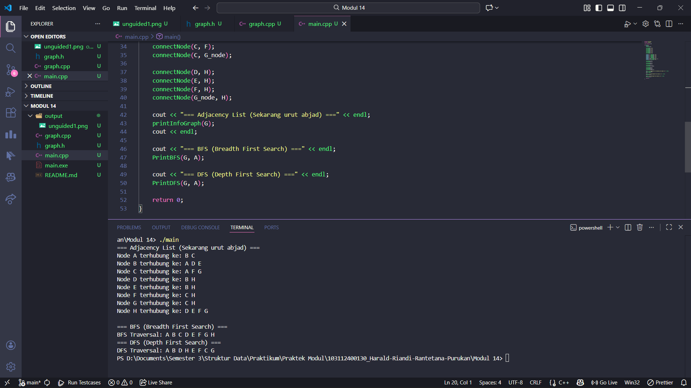

# <h1 align="center">Laporan Praktikum Modul X <br> Nama Modul</h1>
<p align="center"> Harald Riandi Rantetana Purukan - 103112400130 </p>

## Dasar Teori


## Guided

### soal 1

```cpp
kode
```
> Output
> 

penjelasan

## Unguided

### Soal 1

soal

```cpp
kode
```

> Output
> 

Kode yang telah kita buat mengimplementasikan struktur data Graph Undirected (tak berarah) berbasis adjacency list, di mana setiap node menyimpan daftar tetangganya dalam sebuah linked list. Kunci agar urutan penelusuran sama persis dengan diagram kuliah Anda terletak pada penggunaan teknik Insert Last saat menghubungkan node, yang menjamin tetangga tersimpan secara berurutan (FIFO) di memori. Algoritma DFS (Depth First Search) dibangun menggunakan pendekatan rekursif untuk menyelami satu cabang hingga titik terdalam sebelum melakukan backtracking, menghasilkan jalur penelusuran yang memanjang ke bawah (seperti A ke B, lalu langsung ke D). Sebaliknya, algoritma BFS (Breadth First Search) memanfaatkan struktur data std::queue (antrian) untuk mengunjungi node secara melebar lapis demi lapis (level-order), memastikan semua tetangga terdekat dikunjungi terlebih dahulu sebelum pindah ke level berikutnya. Kedua algoritma ini dikontrol oleh atribut visited untuk mencegah program terjebak dalam putaran tanpa henti (infinite loop) akibat siklus dalam graf.

## Referensi

1. Ma’arif, A. (2020). Dasar Pemrograman C++. UAD Press. Diakses dari https://eprints.uad.ac.id/32726/1/Dasar%20Pemrograman%20Bahasa%20C%2B%2B.pdf

2. (Penulis tidak tertulis). (tahun tidak tertulis). Algoritma & Pemrograman C++ [PDF]. Repository Unpkediri. Diakses dari https://repository.unpkediri.ac.id/2468/1/55201_0701107802.pdf
