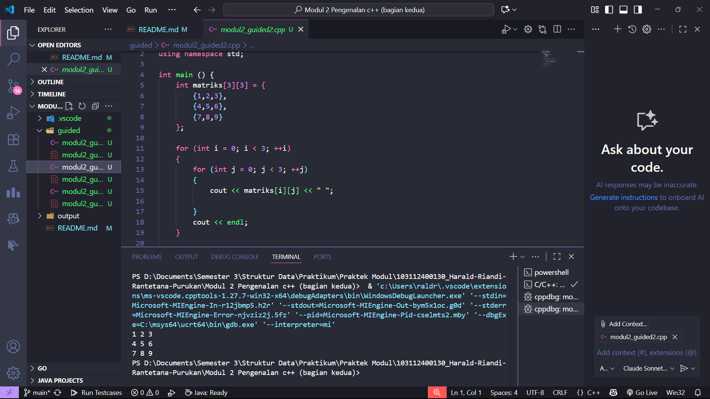

# <h1 align="center">Laporan Praktikum Modul 2<br>Pengenalan C++ (Bagian Kedua)</h1>
<p align="center">Harald Riandi Rantetana Purukan - 103112400130</p>

## Dasar Teori

Bahasa C++ merupakan pengembangan dari bahasa C yang dirancang untuk mendukung konsep pemrograman berorientasi objek. Bahasa ini memiliki struktur yang fleksibel dan efisien karena memadukan kemampuan prosedural dan objek. Program C++ umumnya diawali dengan fungsi utama main(), yang menjadi pusat eksekusi seluruh perintah.

Setiap program C++ terdiri atas variabel, tipe data, operator, dan fungsi. Variabel digunakan untuk menyimpan data, sedangkan tipe data seperti int, float, dan char menentukan jenis nilai yang dapat disimpan. Operator digunakan untuk melakukan operasi aritmatika maupun logika. Selain itu, struktur kontrol seperti if, for, dan while memungkinkan program melakukan pengambilan keputusan dan perulangan sesuai kondisi tertentu.

Interaksi dengan pengguna dilakukan melalui pustaka iostream menggunakan cin untuk input dan cout untuk output. Penggunaan komentar juga penting untuk memberikan keterangan dalam kode agar mudah dipahami. Secara umum, penguasaan dasar C++ meliputi pemahaman struktur program, logika, serta penulisan sintaks yang benar.

## Guided

### 1. Array Satu Dimensi


```cpp
#include <iostream>

using namespace std;

int main() {
    int nilai[5] = {1 , 2 , 3 , 4 , 5};

    for (int i = 0; i < 5; ++i ) {
        cout << "Elemen ke-" << i << " : " << nilai[i] << endl;
    }

    return 0;
}
```
> Output
> 

Program ini mendeklarasikan array nilai berisi lima elemen: 1 sampai 5. Lalu menggunakan perulangan for untuk menampilkan setiap elemen array ke layar. Variabel i berfungsi sebagai indeks yang menunjukkan posisi elemen, dimulai dari 0 hingga 4. Hasilnya, program menampilkan teks seperti “Elemen ke-0 : 1” dan seterusnya sampai elemen terakhir.

### 2. Array Dua Dimensi

```cpp
#include <iostream>

using namespace std;

int main() {
    int matriks[3][3] = {
        {1, 2, 3},
        {4, 5, 6},
        {7, 8, 9}
    };

    for (int i = 0; i < 3; ++i) {
        for (int j = 0; j < 3; ++j) {
            cout << matriks[i][j] << " ";
        }
        // memindah baris setelah setiap baris matriks selesai dicetak
        cout << endl;
    }

    return 0;
}
```

> Output
> 

Program ini membuat matriks 3x3 berisi angka 1 sampai 9, lalu menampilkannya ke layar. Dua perulangan for digunakan: yang pertama (i) untuk baris dan yang kedua (j) untuk kolom. Setiap elemen dicetak berurutan, dan cout << endl; digunakan untuk pindah ke baris baru setelah satu baris matriks selesai ditampilkan. Hasil akhirnya berbentuk tampilan matriks seperti di tabel.

### 3. Pointer

```cpp
#include <iostream>

using namespace std;

int main() {
    int umur = 25;
    int *p_umur;
    p_umur = &umur;

    cout << "Nilai umur: " << umur << endl;
    cout << "Alamat memori 'umur': " << &umur << endl;
    cout << "Nilai 'p_umur' (alamat): " << p_umur << endl;
    cout << "Nilai yang diakses 'p_umur': " << *p_umur << endl;
    cout << "Alamat memori dari pointer 'p_umur' itu sendiri: " << &p_umur << endl;

    return 0;
}
```

> Output
> 

Program ini menjelaskan cara kerja pointer di C++. Variabel umur bernilai 25, lalu dibuat pointer p_umur yang menyimpan alamat memori dari umur. Program menampilkan nilai umur, alamat memorinya, nilai yang disimpan dalam pointer (alamat umur), nilai yang diakses melalui pointer (*p_umur = 25), dan alamat memori tempat pointer itu sendiri disimpan. Tujuannya untuk menunjukkan perbedaan antara nilai, alamat, dan referensi memori dalam pointer.

### 4. Array dan Pointer

```cpp
#include <iostream>
using namespace std;

int main() {
    int data[5] = {10, 20, 30, 40, 50};
    int *p_data = data; 
    
    cout << "Mengakses elemen array menggunakan cara normal:" << endl;

    for (int i = 0; i < 5; ++i) 
    {
        cout << "Nilai elemen ke-" << i << " : " << data[i] << endl;
    }

    cout << "\nMengakses elemen array menggunakan pointer:" << endl;

    for (int i = 0; i < 5; ++i) 
    {
        cout << "Nilai elemen ke-" << i << " : " << *(p_data + i) << endl;
    }

    return 0;
}
```

> Output
> 

Program ini menunjukkan dua cara mengakses elemen array. Pertama, menggunakan cara biasa lewat data[i], dan kedua menggunakan pointer lewat *(p_data + i). Pointer p_data menunjuk ke alamat awal array data, lalu dengan menambahkan nilai i, pointer berpindah ke elemen berikutnya. Hasil kedua cara sama, tapi cara kedua menunjukkan bagaimana pointer bisa digunakan untuk menelusuri isi array melalui alamat memori.

### 5. Pointer dan String

```cpp
#include <iostream>
using namespace std;

int main() {
    char pesan_array[] = "Nasi Padang";
    char *pesan_pointer = "Ayam Bakar 23";

    cout << "String Array: " << pesan_array << endl;
    cout << "String Pointer: " << pesan_pointer << endl;

    // Mengubah karakter dalam array diperbolehkan
    pesan_array[0] = 'h';
    cout << "String Array setelah diubah: " << pesan_array << endl;

    // Pointer dapat diubah untuk menunjuk ke string lain
    pesan_pointer = "Sariman";
    cout << "String Pointer setelah menunjuk ke string lain: " << pesan_pointer << endl;

    return 0;
}
```

> Output
> 

Program ini membandingkan penggunaan string sebagai array dan string sebagai pointer. Variabel pesan_array bisa diubah karakternya langsung, misalnya huruf pertama diganti menjadi 'h'. Sedangkan pesan_pointer tidak mengubah isi string, tapi bisa diarahkan ke string lain seperti "Sariman". Intinya, array menyimpan data langsung di memori, sedangkan pointer hanya menyimpan alamat ke string tertentu.

### 6. Fungsi dan Prosedur

```cpp
#include <iostream>
using namespace std;

int tambah(int a, int b)
{
    return a + b;
}

void tampilkanHasil(int a, int b, int hasil)
{
    cout << "Hasil penjumlahan " << a << " + " << b << " adalah: " << hasil << endl;
}

int main()
{
    int angka1 = 10;
    int angka2 = 5;

    int hasilJumlah = tambah(angka1, angka2);

    tampilkanHasil(angka1, angka2, hasilJumlah);

    return 0;
}
```

> Output
> 

Program ini menggunakan dua fungsi untuk memisahkan logika dan tampilan. Fungsi tambah() menghitung penjumlahan dua angka dan mengembalikan hasilnya. Fungsi tampilkanHasil() menampilkan hasil penjumlahan ke layar. Di main(), nilai angka1 dan angka2 dijumlahkan lewat fungsi tambah(), lalu hasilnya dikirim ke tampilkanHasil(). Tujuannya agar program lebih terstruktur dan mudah dibaca.

### 7. Call by Pointer

```cpp
#include <iostream>
using namespace std;

void tukar(int *px, int *py)
{
    int temp = *px;
    *px = *py;
    *py = temp;
}

int main()
{
    int a = 10, b = 20;
    cout << "Sebelum ditukar: a = " << a << ", b = " << b << endl;
    tukar(&a, &b);
    cout << "Setelah ditukar: a = " << a << ", b = " << b << endl;
    return 0;
}
```

> Output
> 

Program ini menunjukkan cara menukar nilai dua variabel menggunakan pointer. Fungsi tukar() menerima alamat dari a dan b, lalu menukar nilainya dengan bantuan variabel sementara temp. Karena yang dikirim adalah alamat (&a dan &b), perubahan terjadi langsung pada variabel aslinya. Hasilnya, setelah fungsi dijalankan, nilai a dan b saling bertukar.

### 8. Call by Reference

```cpp
#include <iostream>
using namespace std;

void tukar(int &x, int &y)
{
    int temp = x;
    x = y;
    y = temp;
}

int main()
{
    int a = 10, b = 20;
    cout << "Sebelum ditukar: a = " << a << ", b = " << b << endl;
    tukar(a, b);
    cout << "Setelah ditukar: a = " << a << ", b = " << b << endl;
    return 0;
}
```

> Output
> 

Program ini menukar nilai dua variabel menggunakan referensi. Fungsi tukar() menerima x dan y sebagai referensi, artinya langsung mengacu ke variabel asli (a dan b). Nilai x dan y ditukar memakai variabel sementara temp. Karena memakai referensi, tidak perlu mengirim alamat seperti pada pointer, dan hasilnya nilai a dan b langsung tertukar setelah fungsi dijalankan.

## Unguided

### Soal 1

Buatlah sebuah program untuk melakukan transpose pada sebuah matriks persegi berukuran 3x3. Operasi transpose adalah mengubah baris menjadi kolom dan sebaliknya. Inisialisasi matriks awal di dalam kode, kemudian buat logika untuk melakukan transpose dan simpan hasilnya ke dalam matriks baru. Terakhir, tampilkan matriks awal dan matriks hasil transpose.

Contoh Output:

Matriks Awal:<br>
1 2 3<br>
4 5 6<br>
7 8 9

Matriks Hasil Transpose:<br>
1 4 7<br>
2 5 8<br>
3 6 9

```cpp
#include <iostream>
using namespace std;

int main() {
    // Inisialisasi matriks awal 3x3
    int matriks[3][3] = {
        {1, 2, 3},
        {4, 5, 6},
        {7, 8, 9}
    };

    // Menyimpan hasil transpose
    int transpose[3][3];

    // Melakukan transpose (baris jadi kolom, kolom jadi baris)
    for (int i = 0; i < 3; ++i) {
        for (int j = 0; j < 3; ++j) {
            transpose[j][i] = matriks[i][j];
        }
    }

    // Menampilkan matriks awal
    cout << "Matriks Awal:" << endl;
    for (int i = 0; i < 3; ++i) {
        for (int j = 0; j < 3; ++j) {
            cout << matriks[i][j] << " ";
        }
        cout << endl;
    }

    // Menampilkan hasil transpose
    cout << "\nMatriks Hasil Transpose:" << endl;
    for (int i = 0; i < 3; ++i) {
        for (int j = 0; j < 3; ++j) {
            cout << transpose[i][j] << " ";
        }
        cout << endl;
    }

    return 0;
}
```

> Output
> 

Program ini membuat matriks 3x3, lalu menukarkan baris menjadi kolom dengan cara menyimpan nilai matriks[i][j] ke transpose[j][i]. Dua perulangan for digunakan untuk menelusuri setiap elemen. Setelah proses selesai, program menampilkan matriks awal dan matriks hasil transpose. Hasilnya, posisi elemen pada baris dan kolom saling bertukar.

## Soal 2

Buatlah program yang menunjukkan penggunaan call by reference. Buat sebuah prosedur bernama kuadratkan yang menerima satu parameter integer secara referensi (&). Prosedur ini akan mengubah nilai asli variabel yang dilewatkan dengan nilai kuadratnya. Tampilkan nilai variabel di main() sebelum dan sesudah memanggil prosedur untuk membuktikan perubahannya. 

Contoh Output:

Nilai awal: 5<br>
Nilai setelah dikuadratkan: 25

```cpp
#include <iostream>
using namespace std;

// Prosedur untuk mengkuadratkan nilai dengan call by reference
void kuadratkan(int &x) {
    x = x * x; // Nilai asli diubah menjadi kuadratnya
}

int main() {
    int angka = 5;

    cout << "Nilai awal: " << angka << endl;

    // Memanggil prosedur dengan referensi
    kuadratkan(angka);

    cout << "Nilai setelah dikuadratkan: " << angka << endl;

    return 0;
}
```

> Output
> 

Program ini menunjukkan konsep call by reference, yaitu ketika variabel dikirim ke fungsi dengan tanda &, maka yang dikirim adalah alamat variabel aslinya, bukan salinannya. Prosedur kuadratkan() mengubah nilai x menjadi hasil kuadratnya, dan karena menggunakan referensi, perubahan ini langsung memengaruhi variabel asli di main(). Jadi setelah fungsi dipanggil, nilai angka berubah dari 5 menjadi 25.

## Referensi

1. Ma’arif, A. (2020). Dasar Pemrograman C++. UAD Press. Diakses dari https://eprints.uad.ac.id/32726/1/Dasar%20Pemrograman%20Bahasa%20C%2B%2B.pdf

2. (Penulis tidak tertulis). (tahun tidak tertulis). Algoritma & Pemrograman C++ [PDF]. Repository Unpkediri. Diakses dari https://repository.unpkediri.ac.id/2468/1/55201_0701107802.pdf