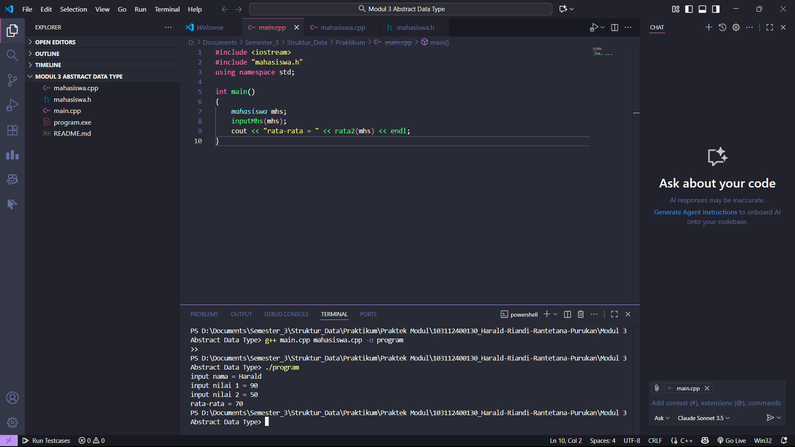
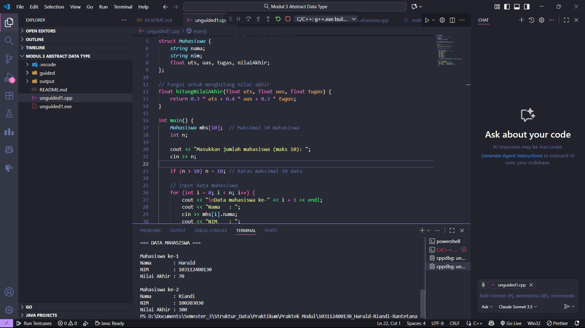
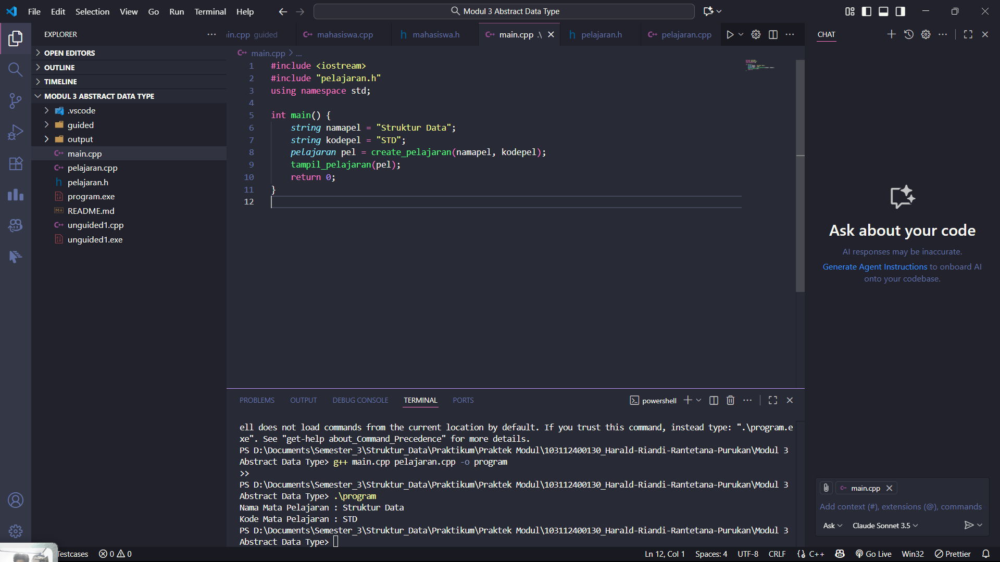
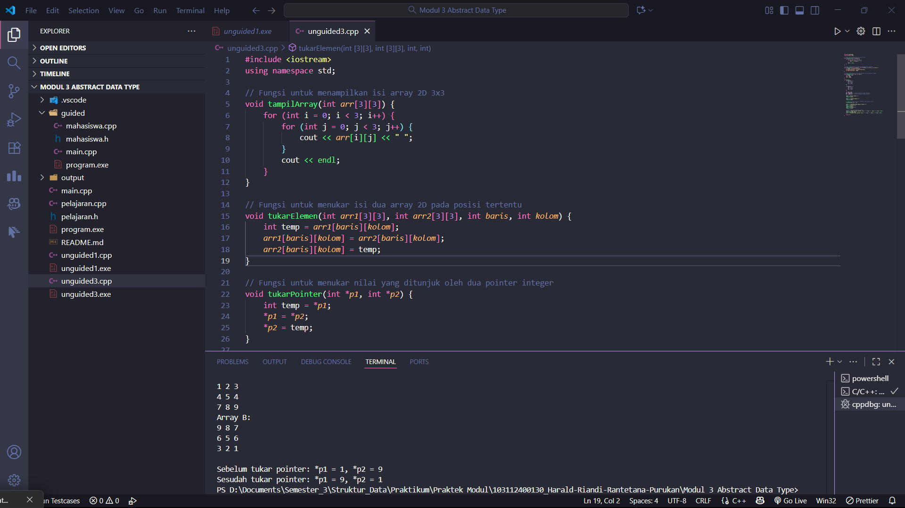

# <h1 align="center">Laporan Praktikum Modul 3 <br> Abstract Data Type </h1>
<p align="center">Harald Riandi Rantetana Purukan - 103112400130</p>

## Dasar Teori

Abstract Data Type (ADT) adalah suatu konsep dalam pemrograman yang mendefinisikan tipe data secara abstrak, yaitu dengan menekankan pada operasi atau fungsi yang dapat dilakukan terhadap data tanpa memerhatikan bagaimana data tersebut diimplementasikan atau disimpan di memori. ADT berperan sebagai model logis yang memisahkan antara spesifikasi dan implementasi, sehingga membantu dalam membangun program yang lebih terstruktur, modular, dan mudah dikembangkan. Dalam C++, ADT biasanya diimplementasikan menggunakan struct atau class yang berisi atribut dan fungsi untuk mengelola data. Dengan adanya ADT, pengembang dapat memfokuskan diri pada perilaku dan interaksi data tanpa perlu memahami detail teknis penyimpanannya, yang pada akhirnya meningkatkan keterbacaan serta pemeliharaan program.

## Guided

### soal 1

main.cpp
```cpp
#include <iostream>
#include "mahasiswa.h"
using namespace std;

int main()
{
    mahasiswa mhs;
    inputMhs(mhs);
    cout << "rata-rata = " << rata2(mhs) << endl;
}
```

mahasiswa.cpp
```cpp
#include "mahasiswa.h"
#include <iostream>
using namespace std;

void inputMhs(mahasiswa &m)
{
    cout << "input nama = ";
    cin >> (m).nim;
    cout << "input nilai 1 = ";
    cin >> (m).nilai1;
    cout << "input nilai 2 = ";
    cin >> (m).nilai2;
}
float rata2(mahasiswa m)
{
    return (m.nilai1 + m.nilai2) / 2.0;
}
```

mahasiswa.h
```cpp
#ifndef MAHASISWA_H_INCLUDED
#define MAHASISWA_H_INCLUDED
struct mahasiswa
{
    char nim[10];
    int nilai1, nilai2;
};
void inputMhs(mahasiswa &m);
float rata2(mahasiswa m);
#endif
```
> Output
> 

Dicompile dengan g++ main.cpp mahasiswa.cpp -o program
Kemudian dijalankan dengan ./program


Program ini terdiri dari tiga bagian utama yang bekerja sama untuk membentuk satu kesatuan Abstract Data Type (ADT) bernama mahasiswa.

File header (mahasiswa.h) berisi definisi struktur mahasiswa, yang menyimpan data nim, nilai1, dan nilai2, serta deklarasi fungsi inputMhs() dan rata2(). File ini berfungsi sebagai “kerangka” atau spesifikasi ADT.

File implementasi (mahasiswa.cpp) berisi fungsi-fungsi yang mengolah data mahasiswa, yaitu inputMhs() untuk menerima input dari pengguna dan menyimpan data ke dalam struktur, serta rata2() untuk menghitung rata-rata dari dua nilai. Bagian ini adalah implementasi ADT.

File utama (main.cpp) memanggil fungsi dari ADT tersebut. Di sini dibuat objek mhs dari tipe mahasiswa, lalu program memanggil inputMhs(mhs) untuk mengisi data dan mencetak hasil perhitungan rata2(mhs).

Secara keseluruhan, program ini menunjukkan penerapan konsep ADT di mana data (mahasiswa) dan operasi terhadapnya (inputMhs, rata2) dibungkus menjadi satu kesatuan yang modular dan mudah digunakan kembali.

## Unguided

### Soal 1

Buat program yang dapat menyimpan data mahasiswa (max. 10) ke dalam sebuah array
dengan field nama, nim, uts, uas, tugas, dan nilai akhir. Nilai akhir diperoleh dari FUNGSI
dengan rumus 0.3*uts+0.4*uas+0.3*tugas.

```cpp
#include <iostream>
using namespace std;

// Struktur data untuk menyimpan data mahasiswa
struct Mahasiswa {
    string nama;
    string nim;
    float uts, uas, tugas, nilaiAkhir;
};

// Fungsi untuk menghitung nilai akhir
float hitungNilaiAkhir(float uts, float uas, float tugas) {
    return 0.3 * uts + 0.4 * uas + 0.3 * tugas;
}

int main() {
    Mahasiswa mhs[10];  // Maksimal 10 mahasiswa
    int n;

    cout << "Masukkan jumlah mahasiswa (maks 10): ";
    cin >> n;

    if (n > 10) n = 10; // Batas maksimal 10 data

    // Input data mahasiswa
    for (int i = 0; i < n; i++) {
        cout << "\nData mahasiswa ke-" << i + 1 << endl;
        cout << "Nama   : ";
        cin >> mhs[i].nama;
        cout << "NIM    : ";
        cin >> mhs[i].nim;
        cout << "UTS    : ";
        cin >> mhs[i].uts;
        cout << "UAS    : ";
        cin >> mhs[i].uas;
        cout << "Tugas  : ";
        cin >> mhs[i].tugas;

        // Hitung nilai akhir menggunakan fungsi
        mhs[i].nilaiAkhir = hitungNilaiAkhir(mhs[i].uts, mhs[i].uas, mhs[i].tugas);
    }

    // Tampilkan data mahasiswa
    cout << "\n=== DATA MAHASISWA ===" << endl;
    for (int i = 0; i < n; i++) {
        cout << "\nMahasiswa ke-" << i + 1 << endl;
        cout << "Nama        : " << mhs[i].nama << endl;
        cout << "NIM         : " << mhs[i].nim << endl;
        cout << "Nilai Akhir : " << mhs[i].nilaiAkhir << endl;
    }

    return 0;
}
```

> Output
> 

Program menggunakan struct Mahasiswa untuk menyimpan data: nama, nim, uts, uas, tugas, dan nilaiAkhir.

Fungsi hitungNilaiAkhir() digunakan untuk menghitung nilai akhir dengan rumus:

nilai akhir = 0.3 * uts + 0.4 * uas + 0.3 * tugas


Data disimpan dalam array mhs[10], yang berarti maksimal 10 mahasiswa.

Program meminta input data dari pengguna, menghitung nilai akhir dengan fungsi, lalu menampilkannya kembali.

### Soal 2

Buatlah ADT pelajaran sebagai berikut di dalam file “pelajaran.h”:
Type pelajaran <
namaMapel : string
kodeMapel : string
>
function create_pelajaran( namapel : string,
kodepel : string ) → pelajaran
procedure tampil_pelajaran( input pel : pelajaran )

Buatlah implementasi ADT pelajaran pada file “pelajaran.cpp”
Cobalah hasil implementasi ADT pada file “main.cpp”
using namespace std;
int main(){
string namapel = "Struktur Data";
string kodepel = "STD";
pelajaran pel = create_pelajaran(namapel,kodepel);
tampil_pelajaran(pel);
return 0;}

main.cpp
```cpp
#include <iostream>
#include "pelajaran.h"
using namespace std;

int main() {
    string namapel = "Struktur Data";
    string kodepel = "STD";
    pelajaran pel = create_pelajaran(namapel, kodepel);
    tampil_pelajaran(pel);
    return 0;
}

```

pelajaran.cpp
```cpp
#include <iostream>
#include "pelajaran.h"
using namespace std;

pelajaran create_pelajaran(string namapel, string kodepel) {
    pelajaran p;
    p.namaMapel = namapel;
    p.kodeMapel = kodepel;
    return p;
}

void tampil_pelajaran(pelajaran pel) {
    cout << "Nama Mata Pelajaran : " << pel.namaMapel << endl;
    cout << "Kode Mata Pelajaran : " << pel.kodeMapel << endl;
}

```

pelajaran.h
```cpp
#ifndef PELAJARAN_H
#define PELAJARAN_H

#include <string>
using namespace std;

struct pelajaran {
    string namaMapel;
    string kodeMapel;
};

// Fungsi untuk membuat pelajaran baru
pelajaran create_pelajaran(string namapel, string kodepel);

// Prosedur untuk menampilkan data pelajaran
void tampil_pelajaran(pelajaran pel);

#endif
```

> Output
> 

Program ini membuat Abstract Data Type (ADT) bernama pelajaran yang berisi dua atribut: namaMapel dan kodeMapel. File pelajaran.h digunakan untuk mendefinisikan struktur dan deklarasi fungsi, file pelajaran.cpp berisi implementasi fungsi dan prosedur, sedangkan main.cpp digunakan untuk menguji ADT dengan membuat objek pelajaran dan menampilkannya. Fungsi create_pelajaran() digunakan untuk membuat data pelajaran baru, sedangkan tampil_pelajaran() untuk menampilkan isinya ke layar.

### Soal 3

soalBuatlah program dengan ketentuan :
- 2 buah array 2D integer berukuran 3x3 dan 2 buah pointer integer
- fungsi/prosedur yang menampilkan isi sebuah array integer 2D
- fungsi/prosedur yang akan menukarkan isi dari 2 array integer 2D pada posisi tertentu
- fungsi/prosedur yang akan menukarkan isi dari variabel yang ditunjuk oleh 2 buah
pointer

```cpp
#include <iostream>
using namespace std;

// Fungsi untuk menampilkan isi array 2D 3x3
void tampilArray(int arr[3][3]) {
    for (int i = 0; i < 3; i++) {
        for (int j = 0; j < 3; j++) {
            cout << arr[i][j] << " ";
        }
        cout << endl;
    }
}

// Fungsi untuk menukar isi dua array 2D pada posisi tertentu
void tukarElemen(int arr1[3][3], int arr2[3][3], int baris, int kolom) {
    int temp = arr1[baris][kolom];
    arr1[baris][kolom] = arr2[baris][kolom];
    arr2[baris][kolom] = temp;
}

// Fungsi untuk menukar nilai yang ditunjuk oleh dua pointer integer
void tukarPointer(int *p1, int *p2) {
    int temp = *p1;
    *p1 = *p2;
    *p2 = temp;
}

int main() {
    int A[3][3] = {
        {1, 2, 3},
        {4, 5, 6},
        {7, 8, 9}
    };

    int B[3][3] = {
        {9, 8, 7},
        {6, 5, 4},
        {3, 2, 1}
    };

    int *p1, *p2;
    p1 = &A[0][0]; // pointer menunjuk elemen pertama A
    p2 = &B[0][0]; // pointer menunjuk elemen pertama B

    cout << "Array A awal:\n";
    tampilArray(A);

    cout << "\nArray B awal:\n";
    tampilArray(B);

    // Tukar isi array di posisi tertentu, misal posisi [1][2]
    tukarElemen(A, B, 1, 2);

    cout << "\nSetelah tukar posisi [1][2]:\n";
    cout << "Array A:\n";
    tampilArray(A);
    cout << "Array B:\n";
    tampilArray(B);

    // Tukar nilai yang ditunjuk pointer
    cout << "\nSebelum tukar pointer: *p1 = " << *p1 << ", *p2 = " << *p2 << endl;
    tukarPointer(p1, p2);
    cout << "Sesudah tukar pointer: *p1 = " << *p1 << ", *p2 = " << *p2 << endl;

    return 0;
}
```

> Output
> 

Program ini menggunakan dua array 2D berukuran 3x3 dan dua pointer integer untuk mendemonstrasikan konsep fungsi, array 2D, dan pointer dalam C++.
Fungsi tampilArray() digunakan untuk menampilkan isi array 2D, sedangkan fungsi tukarElemen() berfungsi menukar nilai pada posisi tertentu antara dua array (misalnya baris ke-1 kolom ke-2). Selain itu, fungsi tukarPointer() digunakan untuk menukar nilai yang ditunjuk oleh dua pointer integer dengan memanfaatkan variabel sementara (temp).

Dalam fungsi main(), terdapat dua array (A dan B) yang berisi nilai berbeda. Program pertama menampilkan isi awal kedua array, lalu memanggil tukarElemen() untuk menukar elemen di posisi tertentu antara A dan B. Setelah itu, hasil perubahan ditampilkan kembali untuk menunjukkan efek pertukaran. Terakhir, pointer p1 dan p2 yang semula menunjuk elemen pertama dari masing-masing array juga ditukar nilainya dengan memanggil tukarPointer().

Secara keseluruhan, program ini menunjukkan cara kerja array 2D, fungsi, dan pointer dalam pertukaran nilai antar variabel maupun antar posisi di dalam array.


## Referensi

1. Ma’arif, A. (2020). Dasar Pemrograman C++. UAD Press. Diakses dari https://eprints.uad.ac.id/32726/1/Dasar%20Pemrograman%20Bahasa%20C%2B%2B.pdf

2. (Penulis tidak tertulis). (tahun tidak tertulis). Algoritma & Pemrograman C++ [PDF]. Repository Unpkediri. Diakses dari https://repository.unpkediri.ac.id/2468/1/55201_0701107802.pdf