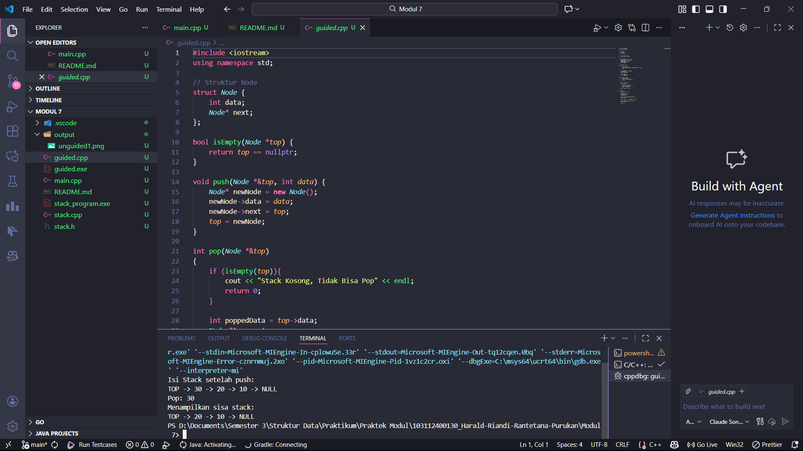
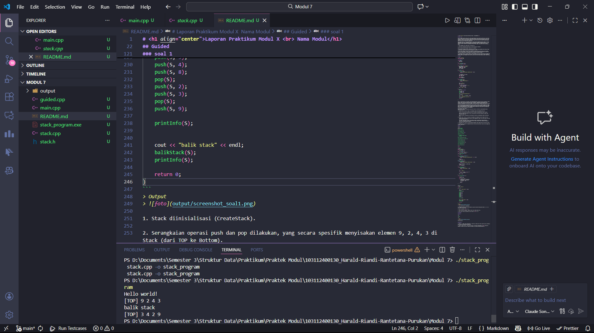
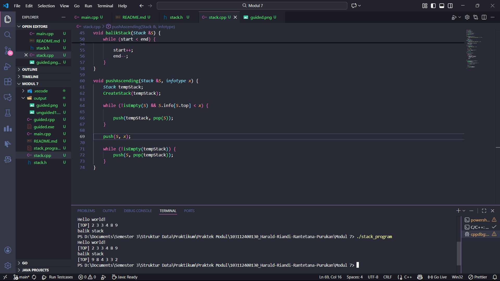
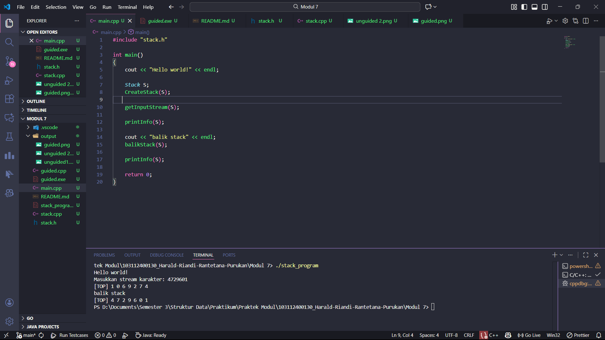

# <h1 align="center">Laporan Praktikum Modul X <br> Nama Modul</h1>
<p align="center"> Harald Riandi Rantetana Purukan - 103112400130 </p>

## Dasar Teori

Stack (Tumpukan) adalah struktur data linear yang mengikuti prinsip operasi LIFO (Last In, First Out). Artinya, elemen data yang terakhir kali dimasukkan ke dalam struktur akan menjadi elemen pertama yang dikeluarkan. Konsep ini mirip dengan tumpukan piring di mana kita hanya dapat menambah (insert) atau mengambil (remove) piring dari posisi paling atas. Dalam struktur data ini, akses ke elemen dibatasi hanya pada satu ujung yang disebut sebagai TOP.

Dalam kode program ini, Stack diimplementasikan secara dinamis menggunakan Singly Linked List, bukan menggunakan array statis. Penggunaan Linked List memberikan keuntungan fleksibilitas memori, di mana ukuran Stack dapat bertambah atau berkurang sesuai kebutuhan tanpa perlu mendeklarasikan ukuran maksimal di awal. Struktur dasar pembangunnya disebut Node (simpul), yang terdiri dari dua komponen utama:

1. Data: Menyimpan nilai (dalam kasus ini bertipe int).

2. Pointer Next: Menyimpan alamat memori dari node berikutnya di bawahnya.

Operasi utama dalam Stack berbasis Linked List ini meliputi:

1. Inisialisasi & IsEmpty: Pointer top awalnya di-set ke nullptr yang menandakan Stack kosong. Fungsi isEmpty bekerja dengan memeriksa apakah top menunjuk ke nullptr.

2. Push (Operasi Masuk): Saat data baru ditambahkan, program mengalokasikan memori baru (new Node). Node baru ini diletakkan di posisi paling atas, di mana pointer next-nya akan menunjuk ke elemen top yang lama, kemudian pointer top diperbarui untuk menunjuk ke node baru tersebut.

3. Pop (Operasi Keluar): Saat data diambil, program mengambil nilai dari node top saat ini. Pointer top kemudian digeser ke node berikutnya (top->next). Hal yang krusial dalam Linked List adalah penggunaan perintah delete untuk menghapus node lama dari memori agar tidak terjadi kebocoran memori (memory leak).

## Guided

```cpp
#include <iostream>
using namespace std;

// Struktur Node
struct Node {
    int data;
    Node* next;
};

bool isEmpty(Node *top) {
    return top == nullptr;
}

void push(Node *&top, int data) {
    Node* newNode = new Node();
    newNode->data = data;
    newNode->next = top;
    top = newNode;
}

int pop(Node *&top)
{
    if (isEmpty(top)){
        cout << "Stack Kosong, Tidak Bisa Pop" << endl;
        return 0;
    }

    int poppedData = top->data;
    Node *temp = top;
    top = top->next;

    delete temp;
    return poppedData;
}

void show(Node *top) {
    if (isEmpty(top)) {
        cout << "Stack kosong.\n";
        return;
    }

    cout << "TOP -> ";
    Node *temp = top;

    while (temp != nullptr) {
        cout << temp->data << " -> ";
        temp = temp->next;
    }
    cout << "NULL" << endl;
}

int main(){
    Node *stack = nullptr;

    push(stack, 10);
    push(stack, 20);
    push(stack, 30);

    cout << "Isi Stack setelah push:\n";
    show(stack);

    cout << "Pop: " << pop(stack) << endl;

    cout << "Menampilkan sisa stack: \n";
    show(stack);

    return 0;

}
```

> Output
> 

Kode C++ yang diberikan ini berfungsi untuk mengimplementasikan struktur data Stack (Tumpukan), sebuah struktur data linear yang sangat penting dalam ilmu komputer. Implementasi yang digunakan adalah berbasis Singly Linked List, bukan array statis. Pilihan ini memberikan keuntungan pada sifat dinamisnya, memungkinkan ukuran Stack bertambah atau berkurang secara fleksibel selama program berjalan.

Setiap elemen dalam Stack direpresentasikan oleh struct Node. Struktur ini adalah jantung dari Linked List, di mana setiap Node menyimpan dua informasi utama: data (bertipe integer) dan Node* next (sebuah pointer yang menghubungkan node saat ini dengan node di bawahnya, atau NULL jika sudah mencapai dasar Stack). Operasi pada Stack ini selalu berfokus pada satu titik akses, yaitu pointer top, yang selalu menunjuk ke elemen yang paling baru ditambahkan.

Prinsip Operasi Utama (LIFO)
Operasi kode ini berjalan berdasarkan prinsip LIFO (Last-In, First-Out), yang diwujudkan melalui fungsi-fungsi berikut:

1. push(Node *&top, int data): Fungsi ini bertanggung jawab untuk menambahkan data baru.

    Fungsi ini pertama-tama menciptakan node baru (new Node) dan mengalokasikan memori untuknya.

    Node baru tersebut diposisikan di atas, di mana pointer next-nya akan menunjuk ke elemen yang sebelumnya adalah top.

    Akhirnya, pointer top diperbarui untuk menunjuk ke node baru, menjadikannya elemen teratas yang baru.  

2. pop(Node *&top): Fungsi ini bertugas untuk mengambil dan menghapus data dari bagian atas Stack.

    Langkah pertama adalah pemeriksaan kondisi kosong menggunakan isEmpty. Jika Stack kosong, Pop tidak dapat dilakukan (underflow).

    Jika Stack tidak kosong, data dari top disimpan, pointer top dimajukan ke node berikutnya (top->next), dan memori dari node lama yang telah diambil datanya segera dibebaskan menggunakan delete untuk mencegah kebocoran memori.

3. isEmpty(Node *top): Fungsi ini hanya melakukan pengecekan cepat apakah pointer top bernilai nullptr.

4. show(Node *top): Fungsi ini menampilkan semua isi Stack secara berurutan, mulai dari top hingga node terakhir sebelum NULL.


## Unguided

### soal 1

Buatlah ADT Stack menggunakan ARRAY sebagai berikut di dalam file “stack.h” dan buatlah implementasi ADT Stack menggunakan Array pada file “stack.cpp” dan “main.cpp” 

stack.h
```h
#ifndef STACK_H
#define STACK_H

#include <iostream>

using namespace std;

const int MAX_SIZE = 20;

typedef int infotype;

struct Stack {
    infotype info[MAX_SIZE]; 
    int top;                 
};
void CreateStack(Stack &S);

void push(Stack &S, infotype x);

infotype pop(Stack &S);

void printInfo(Stack S);

void balikStack(Stack &S);

bool isEmpty(Stack S);

bool isFull(Stack S);

#endif
```

stack.cpp
```cpp
#include "stack.h"
bool isEmpty(Stack S) {
    return S.top == -1; 
}
bool isFull(Stack S) {
    return S.top == MAX_SIZE - 1; 
}
void CreateStack(Stack &S) {
    S.top = -1; 
}

void push(Stack &S, infotype x) {
    if (isFull(S)) {
        cout << "Stack Penuh, tidak bisa push " << x << endl;
        return;
    }
    S.top++;
    S.info[S.top] = x;
}
infotype pop(Stack &S) {
    if (isEmpty(S)) {
        cout << "Stack Kosong, tidak bisa pop." << endl;
        return 0; 
    }
    infotype poppedData = S.info[S.top];
    S.top--; 
    return poppedData;
}

void printInfo(Stack S) {
    if (isEmpty(S)) {
        cout << "Stack kosong." << endl;
        return;
    }

    cout << "[TOP] ";
   
    for (int i = S.top; i >= 0; i--) {
        cout << S.info[i] << " ";
    }
    cout << endl;
}

void balikStack(Stack &S) {
   
    int start = 0;
    int end = S.top;

    while (start < end) {
        infotype temp = S.info[start];
        S.info[start] = S.info[end];
        S.info[end] = temp;
        
        start++;
        end--;
    }
}
```

main.cpp
```cpp
#include "stack.h" 

int main()
{
    cout << "Hello world!" << endl;

    Stack S; 
    CreateStack(S);

    push(S, 3); 
    push(S, 4);
    push(S, 8); 
    pop(S); 
    push(S, 2); 
    push(S, 3); 
    pop(S); 
    push(S, 9); 

    printInfo(S); 
    

    cout << "balik stack" << endl;
    balikStack(S);
    printInfo(S); 

    return 0;
}
```
> Output
> 

1. Stack diinisialisasi (CreateStack).

2. Serangkaian operasi push dan pop dilakukan, yang secara spesifik menyisakan elemen 9, 2, 4, 3 di Stack (dari TOP ke Bottom).

3. Hasil ini dicetak: [TOP] 9 2 4 3.

4. Fungsi balikStack dipanggil, membalik urutan fisik elemen dalam array.

5. Hasil akhir dicetak, menunjukkan urutan terbalik: [TOP] 3 4 2 9.

### Soal 2

Tambahkan prosedur pushAscending( in/out S : Stack, in x : integer) 

stack.h
```h
#ifndef STACK_H
#define STACK_H

#include <iostream>

using namespace std;

const int MAX_SIZE = 20;

typedef int infotype;

struct Stack {
    infotype info[MAX_SIZE]; 
    int top;                 
};
void CreateStack(Stack &S);

void push(Stack &S, infotype x);

infotype pop(Stack &S);

void printInfo(Stack S);

void balikStack(Stack &S);

bool isEmpty(Stack S);

bool isFull(Stack S);

void pushAscending(Stack &S, infotype x);

#endif
```

stack.cpp
```cpp
#include "stack.h"

bool isEmpty(Stack S) {
    return S.top == -1; 
}
bool isFull(Stack S) {
    return S.top == MAX_SIZE - 1; 
}
void CreateStack(Stack &S) {
    S.top = -1; 
}

void push(Stack &S, infotype x) {
    if (isFull(S)) {
        cout << "Stack Penuh, tidak bisa push " << x << endl;
        return;
    }
    S.top++;
    S.info[S.top] = x;
}
infotype pop(Stack &S) {
    if (isEmpty(S)) {
        cout << "Stack Kosong, tidak bisa pop." << endl;
        return 0; 
    }
    infotype poppedData = S.info[S.top];
    S.top--; 
    return poppedData;
}

void printInfo(Stack S) {
    if (isEmpty(S)) {
        cout << "Stack kosong." << endl;
        return;
    }

    cout << "[TOP] ";
   
    for (int i = S.top; i >= 0; i--) {
        cout << S.info[i] << " ";
    }
    cout << endl;
}

void balikStack(Stack &S) {
   
    int start = 0;
    int end = S.top;

    while (start < end) {
        infotype temp = S.info[start];
        S.info[start] = S.info[end];
        S.info[end] = temp;
        
        start++;
        end--;
    }
}

void pushAscending(Stack &S, infotype x) {
    Stack tempStack;
    CreateStack(tempStack);

    while (!isEmpty(S) && S.info[S.top] < x) {
      
        push(tempStack, pop(S));
    }

    push(S, x);

    while (!isEmpty(tempStack)) {
        push(S, pop(tempStack));
    }
}
```

main.cpp
```cpp
#include "stack.h" 

int main()
{
    cout << "Hello world!" << endl;
    
    Stack S; 
    CreateStack(S);

    pushAscending(S, 3);    
    pushAscending(S, 4);    
    pushAscending(S, 8);    
    pushAscending(S, 2);    
    pushAscending(S, 3);    
    pushAscending(S, 9);    
    
    printInfo(S); 
    
    cout << "balik stack" << endl;
    balikStack(S);

    
    printInfo(S); 

    return 0;
}
```

> Output
> 

Prosedur pushAscending menambahkan data baru ke Stack sambil memastikan urutan Stack tetap teratur.

Mekanisme Pengurutan: Untuk mempertahankan urutan, fungsi ini memanfaatkan Stack temporer:

Ketika elemen baru (x) dimasukkan, elemen dari Stack utama (S) yang lebih besar dari x akan dipindahkan sementara ke Stack temporer.

Setelah x dimasukkan ke posisi yang tepat, elemen dari Stack temporer dikembalikan lagi ke Stack utama.

Hasil Akhir Pengurutan: Proses ini menghasilkan Stack di mana elemen terkecil selalu berada di TOP dan elemen terbesar berada di Bottom.

### Soal 3

Tambahkan prosedur getInputStream( in/out S : Stack ). Prosedur akan terus membaca dan 
menerima input user dan memasukkan setiap input ke dalam stack hingga user menekan 
tombol enter. Contoh: gunakan cin.get() untuk mendapatkan inputan user.

stack.h
```h
#ifndef STACK_H
#define STACK_H

#include <iostream>

using namespace std;

const int MAX_SIZE = 20;

typedef char infotype;

struct Stack {
    infotype info[MAX_SIZE]; 
    int top;                 
};
void CreateStack(Stack &S);

void push(Stack &S, infotype x);

infotype pop(Stack &S);

void printInfo(Stack S);

void balikStack(Stack &S);

bool isEmpty(Stack S);

bool isFull(Stack S);

void getInputStream(Stack &S);

#endif
```

stack.cpp
```cpp
#include "stack.h"

bool isEmpty(Stack S) {
    return S.top == -1; 
}
bool isFull(Stack S) {
    return S.top == MAX_SIZE - 1; 
}
void CreateStack(Stack &S) {
    S.top = -1; 
}

void push(Stack &S, infotype x) {
    if (isFull(S)) {
        cout << "Stack Penuh, tidak bisa push " << x << endl;
        return;
    }
    S.top++;
    S.info[S.top] = x;
}
infotype pop(Stack &S) {
    if (isEmpty(S)) {
        cout << "Stack Kosong, tidak bisa pop." << endl;
        return 0; 
    }
    infotype poppedData = S.info[S.top];
    S.top--; 
    return poppedData;
}

void printInfo(Stack S) {
    if (isEmpty(S)) {
        cout << "Stack kosong." << endl;
        return;
    }

    cout << "[TOP] ";
   
    for (int i = S.top; i >= 0; i--) {
        cout << S.info[i] << " ";
    }
    cout << endl;
}

void balikStack(Stack &S) {
   
    int start = 0;
    int end = S.top;

    while (start < end) {
        infotype temp = S.info[start];
        S.info[start] = S.info[end];
        S.info[end] = temp;
        
        start++;
        end--;
    }
}

void getInputStream(Stack &S) {
    char inputChar;
    cout << "Masukkan stream karakter: "; 
    
    while (cin.get(inputChar) && inputChar != '\n') {
        if (isFull(S)) {
            cout << "\nStack Penuh, tidak bisa menerima input lagi." << endl;
            break;
        }
        push(S, inputChar);
    }
}
```

main.cpp
```cpp
#include "stack.h" 

int main()
{
    cout << "Hello world!" << endl;
    
    Stack S; 
    CreateStack(S);
   
    getInputStream(S); 

    printInfo(S);

    cout << "balik stack" << endl;
    balikStack(S);

    printInfo(S); 

    return 0;
}
```

> Output
> 

Prosedur getInputStream(S): Bertanggung jawab membaca stream karakter dari keyboard secara langsung.

Fungsi ini menggunakan cin.get() di dalam loop untuk membaca setiap karakter satu per satu (termasuk spasi, jika ada).

Setiap karakter yang dibaca akan segera di-push ke dalam Stack, dan proses berhenti ketika pengguna menekan tombol Enter (karakter newline \n).

Prinsip LIFO: Karena Stack digunakan, karakter yang di-input terakhir akan berada di posisi TOP. Contoh: Input 4729601 akan menghasilkan Stack dengan 1 di TOP.


## Referensi

1. Ma’arif, A. (2020). Dasar Pemrograman C++. UAD Press. Diakses dari https://eprints.uad.ac.id/32726/1/Dasar%20Pemrograman%20Bahasa%20C%2B%2B.pdf

2. (Penulis tidak tertulis). (tahun tidak tertulis). Algoritma & Pemrograman C++ [PDF]. Repository Unpkediri. Diakses dari https://repository.unpkediri.ac.id/2468/1/55201_0701107802.pdf
