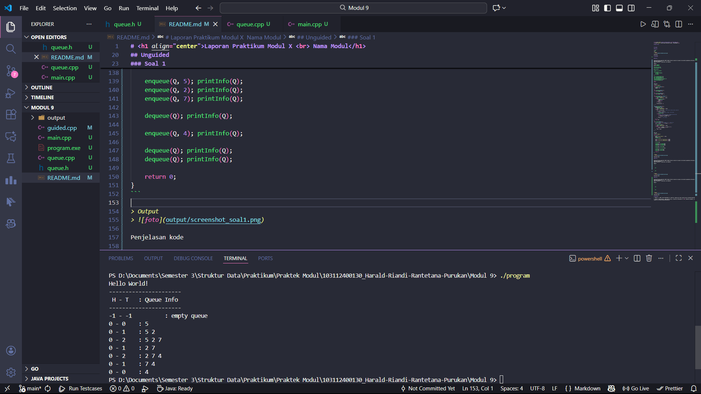

# <h1 align="center">Laporan Praktikum Modul X <br> Nama Modul</h1>
<p align="center"> Harald Riandi Rantetana Purukan - 103112400130 </p>

## Dasar Teori


## Guided

### soal 1

```cpp
#include <iostream>
using namespace std;

#define MAX 5

struct Queue {
    int data[MAX];
    int head;
    int tail;
};

void createQueue(Queue &Q) {
    Q.head = -1;
    Q.tail = -1;
}

bool isEmpty(Queue Q) {
    return (Q.head == -1 && Q.tail == -1);
}

bool isFull(Queue Q) {
    return (Q.tail == MAX - 1);
}

void printQueue(Queue Q) {
    if (isEmpty(Q)) {
        cout << "Queue Kosong\n";
    } else {
        for (int i = Q.head; i <= Q.tail; i++) {
            cout << Q.data[i] << " ";
        }
        cout << endl;
    }
}

void enqueue(Queue &Q, int x) {
    if (isFull(Q)) {
        cout << "Queue Penuh\n";
    } else {
        if (isEmpty(Q)) {
            Q.head = Q.tail = 0;
        } else {
            Q.tail++;
        }
        Q.data[Q.tail] = x;
        cout << "Enqueue: " << x << endl;
    }
}

void dequeue(Queue &Q) {
    if (isEmpty(Q)) {
        cout << "Queue Kosong\n";
    } else {
        cout << "Dequeue: " << Q.data[Q.head] << endl;
        if (Q.head == Q.tail) {
            Q.head = Q.tail = -1;
        } else {
            for (int i = Q.head; i < Q.tail; i++) {
                Q.data[i] = Q.data[i + 1];
            }
            Q.tail--;
        }
    }
}

int main() {
    Queue Q;
    createQueue(Q);

    enqueue(Q, 5);
    enqueue(Q, 2);
    enqueue(Q, 7);
    printQueue(Q);

    dequeue(Q);
    printQueue(Q);

    enqueue(Q, 4);
    enqueue(Q, 9);
    printQueue(Q);

    dequeue(Q);
    dequeue(Q);
    printQueue(Q);
    return 0;
	}
```
> Output
> 

Kode di atas merupakan implementasi Queue menggunakan array dengan mekanisme Alternatif 1 (Head Diam, Tail Bergerak), di mana penambahan data (enqueue) dilakukan dengan menaikkan indeks tail, sedangkan pengambilan data (dequeue) memiliki karakteristik khusus yaitu melakukan pergeseran elemen (shifting). Dalam fungsi dequeue, setelah data di posisi head diambil, terdapat perulangan (for) yang menggeser seluruh elemen yang tersisa maju satu langkah ke indeks yang lebih kecil, sehingga antrian selalu tertata mulai dari posisi awal array, namun konsekuensinya operasi ini membutuhkan waktu komputasi lebih lama karena harus memindahkan data setiap kali terjadi penghapusan.

## Unguided


### Soal 1


Buatlah ADT Queue menggunakan ARRAY sebagai berikut di dalam file “queue.h” dan buatlah implementasi ADT Queue pada file “queue.cpp” dengan menerapkan mekanisme 
queue  Alternatif 1 (head diam, tail bergerak).  

queue.h
```h
#ifndef QUEUE_H
#define QUEUE_H

#include <iostream>
using namespace std;

#define MAX 5

typedef int infotype;

struct Queue {
    infotype info[MAX];
    int head;
    int tail;
};

void createQueue(Queue &Q);
bool isEmptyQueue(Queue Q);
bool isFullQueue(Queue Q);
void enqueue(Queue &Q, infotype x);
infotype dequeue(Queue &Q);
void printInfo(Queue Q);

#endif
```

queue.cpp
```cpp
#include "queue.h"

void createQueue(Queue &Q) {
    Q.head = -1;
    Q.tail = -1;
}

bool isEmptyQueue(Queue Q) {
    return Q.head == -1;
}

bool isFullQueue(Queue Q) {
    return Q.tail == MAX - 1;
}

void enqueue(Queue &Q, infotype x) {
    if (isFullQueue(Q)) {
        cout << "Queue Full" << endl;
    } else {
        if (isEmptyQueue(Q)) {
            Q.head = 0;
            Q.tail = 0;
        } else {
            Q.tail++;
        }
        Q.info[Q.tail] = x;
    }
}

infotype dequeue(Queue &Q) {
    infotype val = -1; 
    if (isEmptyQueue(Q)) {
        cout << "Queue Empty" << endl;
    } else {
        val = Q.info[Q.head]; // Ambil data di head (selalu index 0)
        
        if (Q.head == Q.tail) { 
            // Jika hanya tersisa 1 elemen, reset queue
            createQueue(Q);
        } else {
            // Geser semua elemen ke kiri (Mekanisme Head Diam)
            for (int i = 0; i < Q.tail; i++) {
                Q.info[i] = Q.info[i + 1];
            }
            Q.tail--; // Tail mundur
        }
    }
    return val;
}

void printInfo(Queue Q) {
    // Format output sesuai gambar: H - T : Queue Info
    cout << Q.head << " - " << Q.tail << " \t : ";
    
    if (isEmptyQueue(Q)) {
        cout << "empty queue" << endl;
    } else {
        for (int i = Q.head; i <= Q.tail; i++) {
            cout << Q.info[i] << " ";
        }
        cout << endl;
    }
}
```

main.cpp
```cpp
#include "queue.h"

int main() {
    cout << "Hello World!" << endl;
    Queue Q;
    createQueue(Q);
    
    cout << "----------------------" << endl;
    cout << " H - T \t : Queue Info" << endl;
    cout << "----------------------" << endl;
    
    printInfo(Q);
    
    enqueue(Q, 5); printInfo(Q);
    enqueue(Q, 2); printInfo(Q);
    enqueue(Q, 7); printInfo(Q);
    
    dequeue(Q); printInfo(Q);
    
    enqueue(Q, 4); printInfo(Q);
    
    dequeue(Q); printInfo(Q);
    dequeue(Q); printInfo(Q);
    
    return 0;
}
```

> Output
> 

Program ini mengimplementasikan ADT Queue menggunakan array statis dalam bahasa C++ dengan mekanisme "Alternatif 1", di mana indeks Head dikunci tetap pada posisi 0 sementara Tail bergerak dinamis. Dalam mekanisme ini, operasi enqueue menambahkan data baru pada posisi setelah Tail, sedangkan operasi dequeue mengambil data dari indeks 0 dan secara otomatis menggeser (shifting) seluruh elemen tersisa ke arah kiri untuk mengisi kekosongan, sehingga posisi Tail akan mundur. Kode ini terbagi menjadi modul definisi (queue.h), realisasi fungsi (queue.cpp), dan program utama (main.cpp) yang memvisualisasikan perubahan isi antrean beserta posisi indeks Head dan Tail di terminal setiap kali operasi dilakukan.

### Soal 2 dan 3

Buatlah implementasi ADT Queue pada file “queue.cpp” dengan menerapkan mekanisme 
queue  Alternatif 2 (head bergerak, tail bergerak). 

queue.h
```h
#ifndef QUEUE_H
#define QUEUE_H

#include <iostream>
using namespace std;

#define MAX 5

typedef int infotype;

struct Queue {
    infotype info[MAX];
    int head;
    int tail;
};

void createQueue(Queue &Q);
bool isEmptyQueue(Queue Q);
bool isFullQueue(Queue Q);
void enqueue(Queue &Q, infotype x);
infotype dequeue(Queue &Q);
void printInfo(Queue Q);

#endif
```

queue.cpp
```cpp
#include "queue.h"

void createQueue(Queue &Q) {
    Q.head = -1;
    Q.tail = -1;
}

bool isEmptyQueue(Queue Q) {
    return Q.head == -1;
}

bool isFullQueue(Queue Q) {
    return Q.tail == MAX - 1;
}

void enqueue(Queue &Q, infotype x) {
    if (isFullQueue(Q)) {
        cout << "Queue Full" << endl;
    } else {
        if (isEmptyQueue(Q)) {
            Q.head = 0;
            Q.tail = 0;
        } else {
            Q.tail++;
        }
        Q.info[Q.tail] = x;
    }
}

infotype dequeue(Queue &Q) {
    infotype val = -1;
    if (isEmptyQueue(Q)) {
        cout << "Queue Empty" << endl;
    } else {
        val = Q.info[Q.head];
        if (Q.head == Q.tail) {
            createQueue(Q);
        } else {
            Q.head++;
        }
    }
    return val;
}

void printInfo(Queue Q) {
    cout << Q.head << " - " << Q.tail << " \t : ";
    if (isEmptyQueue(Q)) {
        cout << "empty queue" << endl;
    } else {
        for (int i = Q.head; i <= Q.tail; i++) {
            cout << Q.info[i] << " ";
        }
        cout << endl;
    }
}
```

main.cpp

```cpp
#include "queue.h"

int main() {
    cout << "Hello World!" << endl;
    Queue Q;
    createQueue(Q);
    
    cout << "----------------------" << endl;
    cout << " H - T \t : Queue Info" << endl;
    cout << "----------------------" << endl;
    
    printInfo(Q);
    
    enqueue(Q, 5); printInfo(Q);
    enqueue(Q, 2); printInfo(Q);
    enqueue(Q, 7); printInfo(Q);
    
    dequeue(Q); printInfo(Q);
    
    enqueue(Q, 4); printInfo(Q);
    
    dequeue(Q); printInfo(Q);
    dequeue(Q); printInfo(Q);
    dequeue(Q); printInfo(Q);
    
    return 0;
}
```

> Output
> 

Pada Alternatif 2 (Head dan Tail bergerak tanpa pergeseran), indeks head dan tail terus berjalan maju seiring operasi penambahan dan penghapusan data, namun kelemahannya adalah terjadinya pemborosan memori (memory leak) karena ruang kosong di bagian depan array yang ditinggalkan oleh head tidak dapat digunakan kembali setelah tail mencapai batas maksimum array. Sebaliknya, Alternatif 3 (Circular Queue) menyempurnakan hal tersebut dengan menerapkan konsep melingkar menggunakan operasi modulus, di mana jika indeks mencapai ujung array maka ia akan berputar kembali ke awal, sehingga seluruh slot kosong dapat dimanfaatkan kembali secara efisien tanpa perlu menggeser elemen.

## Referensi

1. Ma’arif, A. (2020). Dasar Pemrograman C++. UAD Press. Diakses dari https://eprints.uad.ac.id/32726/1/Dasar%20Pemrograman%20Bahasa%20C%2B%2B.pdf

2. (Penulis tidak tertulis). (tahun tidak tertulis). Algoritma & Pemrograman C++ [PDF]. Repository Unpkediri. Diakses dari https://repository.unpkediri.ac.id/2468/1/55201_0701107802.pdf
